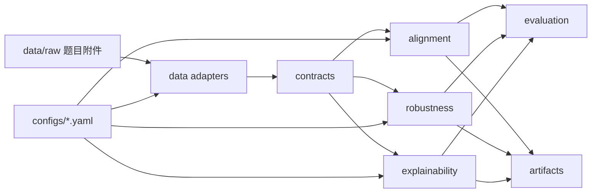

# 系统架构

## 依赖方向

`config → data → contracts → task domains → evaluation/artifacts`。任务域之间不互相导入，公共接口集中在 `contracts`。

## 任务域职责

- `alignment`：原始视频特征提取、跨模态时间组织和特征清单。
- `robustness`：缺失掩码模拟、鲁棒预测和附件3导出。
- `explainability`：贡献计算、证据定位和附件4导出。

## CodeGraph 验收

骨架完成后运行 `codegraph init .`、`codegraph status` 和 `codegraph files`；后续大改动用 `codegraph impact` 检查公共契约影响范围。
