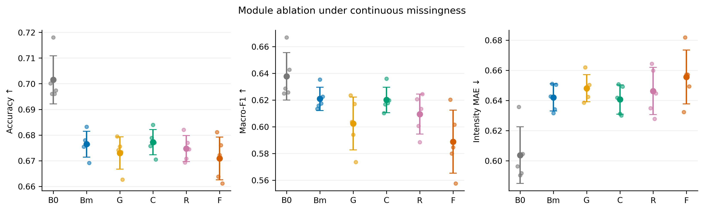
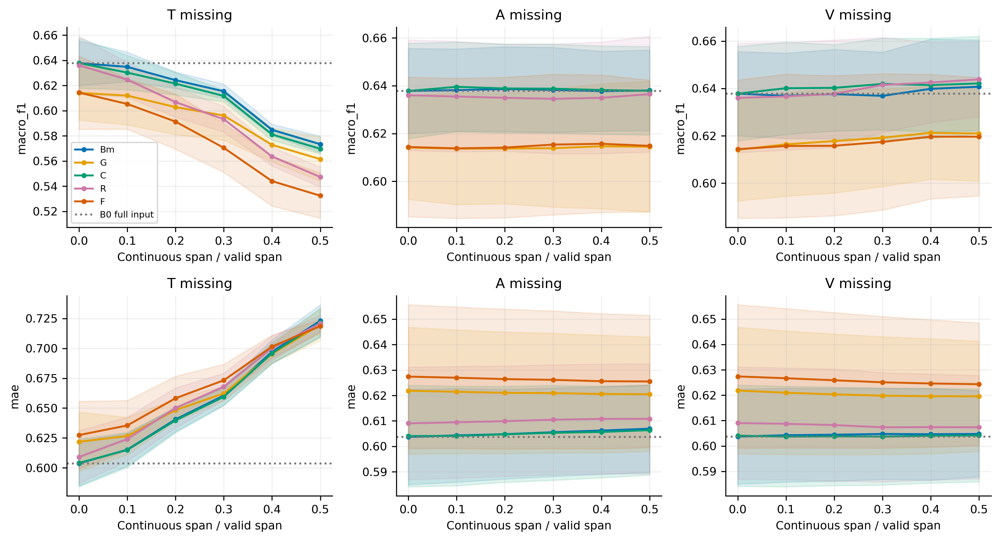
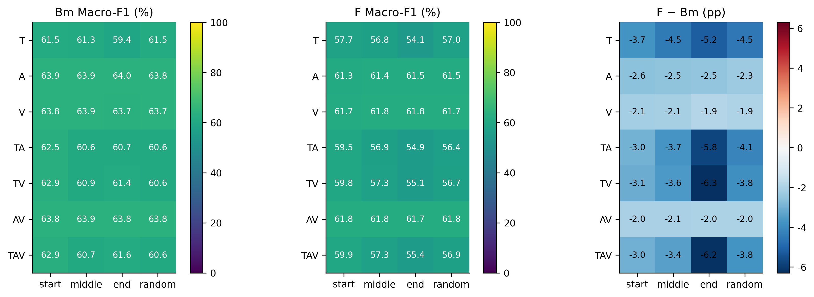
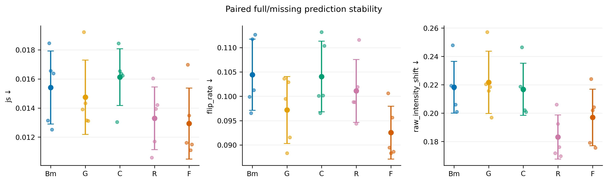
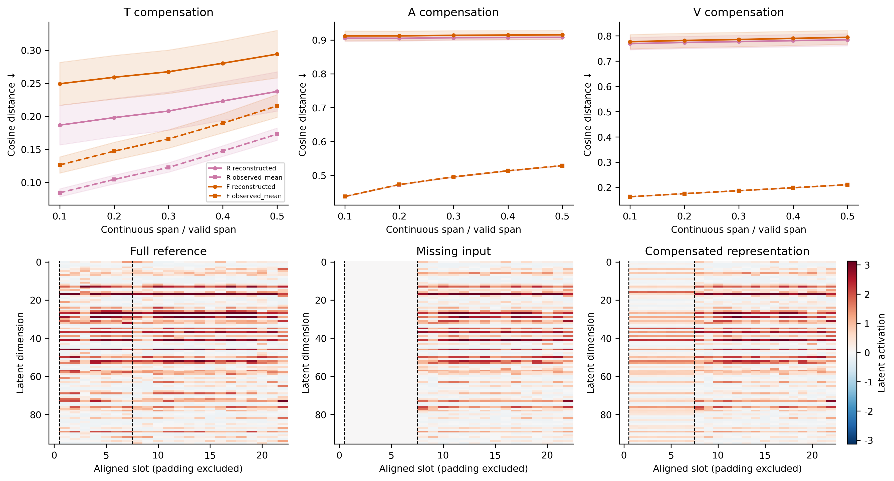
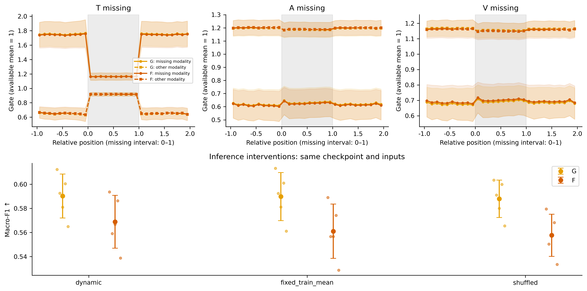

# 图表说明

主图1–3，辅助机制图4–6。误差区间表示跨训练seed的标准差，不是95%置信区间；单seed不画误差区间。

## 01_ablation: 连续模态缺失下的模块消融

图类型/内容：点区间图；横轴实验组，纵轴分别为ACC、Macro-F1、强度MAE。

图注：B0/Bm共用权重，仅评估输入不同。缺失组固定30%跨度，对随机掩码重复先平均，再对七种模态组合等权平均；点为训练seed，区间为跨seed均值±标准差。B0是完整输入参考，不是理论上限。

论证目标：检验缺失退化、单模块独立增益与组合总体收益，不能由六组直接推断模块协同。

## 02_robustness: 连续缺失跨度与预测鲁棒性

图类型/内容：三列对应T/A/V缺失，上排Macro-F1，下排MAE；横轴连续缺失跨度比例。

图注：各组共享相同缺失区间。0%点为各模型完整输入性能；灰色参考线为B0。随机掩码重复在每个训练seed内先平均；阴影为跨seed标准差。跨度以有效槽轴定义，不虚构为秒。

论证目标：检验收益是否跨缺失严重程度持续存在，以及哪种模态缺失最敏感。

## 03_location: 缺失模态组合与位置的性能差异

图类型/内容：热力图；行是七种模态组合，列是start/middle/end/random；显示Bm、F及F−Bm。

图注：固定主缺失比例。联合模态共用连续区间。随机位置重复先合并，所有位置等权；绝对性能共用色标，差值用以0为中心的色标，单位百分点。

论证目标：识别困难场景及局部退化，防止总体均值掩盖失败条件。

## 04_stability: 完整与缺失视图的预测稳定性

图类型/内容：点区间图；横轴模型，纵轴JS散度、极性翻转率、原始强度变化。

图注：同模型、同样本配对比较完整与缺失视图。强度使用未投影原始输出。先合并掩码重复再对模态类型等权汇总。稳定性必须与准确性联合解释。

论证目标：检验一致性训练是否降低输出扰动，同时排除仅稳定地给出错误预测的解释。

## 05_reconstruction: 隐空间补偿质量与表示恢复

图类型/内容：上排为T/A/V缺失跨度与余弦距离曲线，下排为中位误差样本的完整、缺失、重构隐态热力图。

图注：只评价人工遮挡且原本可观测的槽。完整参考来自同一模型同一层。观测均值补偿对照仅使用缺失视图重新编码的可见特征；不同模型坐标不逐维比较。样本按F首个seed的中位误差选择，非最佳案例；目标范数另存以检查坍塌。

论证目标：检验补偿是否比简单观测均值更接近完整表示；接近不自动等于任务性能改善。

## 06_gating: 动态门控响应与推理干预

图类型/内容：上排为缺失边界对齐门控曲线，下排为动态、训练均值固定、样本间打乱门控的Macro-F1。

图注：上排分别显示T/A/V单模态缺失，区间[0,1]为缺失段；门控归一化到有效模态均值1，不是百分比贡献。下排固定TAV主缺失比例；固定门控从train估计，打乱保留同场景门控分布。这些为同权重推理诊断，不是额外训练组。

论证目标：检验门控是否对局部缺失响应，以及输入相关权重是否实际支持预测。

