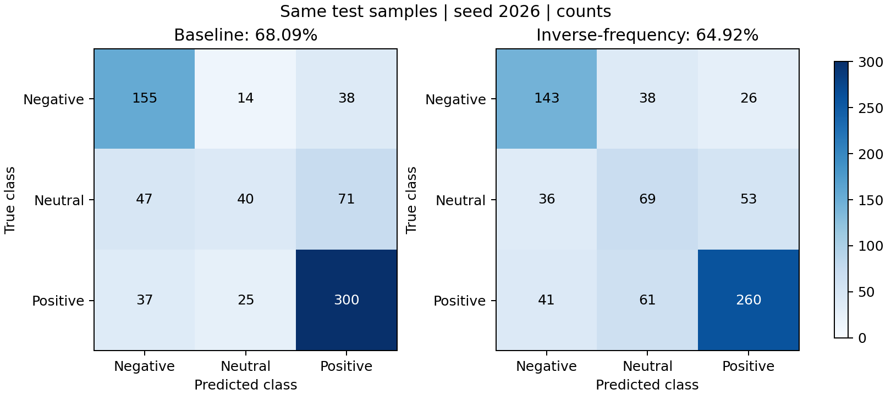

# 类别平衡单seed实验与原模型对比

本次seed=2026，processed_po，float32，cuda:3（RTX 4090）。beta=1，额外中性倍率=1；训练集负、中、正数量为967、758、1670，实际权重为1.170286、1.492964、0.677645。

**结论：测试ACC从68.09%降至64.92%，未达到70%，不替换原正式模型。中性召回和F1提高，但总体准确率、局部缺失准确率及强度误差均退化。**

最多40轮，patience=10；实际训练11轮，按原有验证规则选择第1轮检查点。训练阶段约28.38秒，模型328331个参数，通用BERT特征仍冻结。没有根据测试集挑选训练轮次。

| 完整测试集指标 | 原模型 | 本次类别平衡 |
|---|---:|---:|
| ACC | 68.09% | 64.92% |
| 中性Precision | 50.63% | 41.07% |
| 中性Recall | 25.32% | 43.67% |
| 中性F1 | 33.76% | 42.33% |
| Macro-F1 | 60.36% | 61.16% |
| 负向Recall | 74.88% | 69.08% |
| 正向Recall | 82.87% | 71.82% |
| 弱极性准确率 | 66.15% | 50.00% |
| 强度MAE（越低越好） | 0.6310 | 0.6787 |

完整test共727条：原模型正确495条，本次472条，净减少23条。逐条核对发现纠正37个旧错误，同时新增60个错误。中性正确数40→69，但负类正确数155→143、正类300→260；预测中性总数79→168，中性误报相应增加。

局部30%TAV缺失test：ACC从66.02%降到63.00%，中性召回从25.32%升到39.24%，强度MAE从0.6686升到0.7713。

本次仅验证一个seed和beta=1，不能据此断言所有类别加权无效。若继续比较，可优先考察beta=0.5、额外中性倍率仍为1；本次没有自动启动第二次实验。

详细指标、混淆矩阵和样本纠错计数见 `baseline_comparison.json`，表格见 `baseline_comparison.csv`；新检查点路径与SHA256见 `processed_po_seed2026/experiment_result.json`。原正式检查点SHA256保持为 `3410d5e8a06242e54ea6e328dfcff16b08a252a49a7a4b78779238d13c8520da`。

## 补充诊断：类别平衡合理，为什么总体ACC下降

三类错误的变化如下，均按同一批727条测试样本统计：

| 错误类型 | 原模型 | 加权模型 | 变化 |
| --- | ---: | ---: | ---: |
| 真实中性判为正/负 | 118 | 89 | 减少29 |
| 真实正/负判为中性 | 39 | 99 | 增加60 |
| 真实正负相互误判 | 75 | 67 | 减少8 |

故总错误净增加60−29−8=23。最直接的退化是更多真实极性样本进入中性类别；不能说所有类型的错误都增加了。

理想的无平滑、无辅助项加权交叉熵，在给定输入x时的最优概率为：

\[
q_c^*(x)=\frac{w_cp(c\mid x)}{\sum_jw_jp(j\mid x)}.
\]

因此逆频数权重不仅影响特征学习，也改变最优预测分布。中性与正向权重比约2.20，模型更容易判中性。这是等类别风险与原分布总体准确率之间的取舍；类别均衡并非数学错误，但直接使用加权模型argmax不保证原分布ACC最优。[先验与logit调整研究](https://research.google/pubs/long-tail-learning-via-logit-adjustment/)

为诊断该因素，固定现有模型，采用 `z_c - log(w_c)`，系数预先固定为1，没有用验证/测试标签搜索参数，也未重训或替换任何权重：

| 指标 | 原模型 | 加权模型 | 加权模型＋固定输出校正 |
| --- | ---: | ---: | ---: |
| 验证ACC | 64.84% | 61.26% | 63.46% |
| 测试ACC | 68.09% | 64.92% | 67.81% |
| 测试正确数 | 495 | 472 | 493 |
| 测试中性Recall | 25.32% | 43.67% | 18.35% |
| 测试弱极性准确率 | 66.15% | 50.00% | 66.15% |

不改变模型即可恢复21个正确预测，支持“相当部分下降来自决策倾向变化”。但该校正牺牲了中性召回，也未超过原模型，故只作为诊断，不作为新的正式方案。实际目标含0.03标签平滑、辅助任务和batch权重归一化，上面的理想等式不是当前网络的精确保证；不能据此做严格因果比例分解。

另一个瓶颈是中性与弱极性的可分性。用分类头中性概率排序，测试中性AP从0.4455变为0.4210，ROC-AUC从0.7373变为0.7200；只看中性与弱极性时，AUC从0.5835变为0.5617。验证集上的相应排序指标也没有提高。因此，本次中性Recall增加不足以证明模型学到了更可分的中性特征。

训练后期损失继续下降但验证表现未改善，提示泛化受限；当前证据不支持仅靠延长训练就能解决。冻结通用BERT、共享池化、融合方式和标签边界分别有多大影响，仍需消融，不能从本次单seed实验直接断定。

下一步应继续保留有依据的频数平衡作为候选基础项，分别验证平衡强度、最终决策规则以及中性/弱极性的边界训练，而不是把这次结果解释为所有类别再平衡均无效。原正式模型仍保留。完整诊断、训练曲线数值及检查点哈希见 `error_diagnosis.json`，逐样本logits见本目录 `diagnostic_*.csv`。
