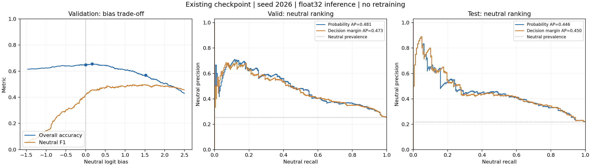

# 中性识别：意见核对、零重训诊断与候选模型

日期：2026-09-25。沿用现有分析报告的竞赛背景、附件数据和三分类定义。

本文参考用户提供的 GPT6pro 意见，对照当前 `problem2/model.py`、数据接口和已有实验进行修订。**已经完成现有检查点诊断，并实现训练集频数平衡及额外中性倍率；独立证据、双头和边界排序架构仍是待验证方案。** 正式检查点没有更换。新训练默认beta=1、额外中性倍率=1；beta=0且倍率=1恢复原训练目标。旧检查点68.09%的测试ACC不属于新加权方案。

## 1. 结论与改进顺序

建议采用“先检查中性决策边界与训练样本权重，再保留独立模态证据，最后训练中性边界”的顺序。事后偏置和训练时加权是不同实验，前者失败不能推出后者无效。

相对上一版建议，有三项调整：

1. 将不重训的中性偏置扫描、PR 曲线分析提前。本次已完成，两个验证集选出的偏置都没有提高测试 ACC。
2. 将中性分数的边界排序损失放在表示空间三元组损失之前。前者直接约束中性与非中性的排序，不要求所有中性表达形成一个紧密簇。
3. 将“给中性头提供什么信息”作为主要架构假设；双头本身只是三类概率的另一种参数化。独立证据必须从跨模态注意力之前提取。

改进目标仍是测试集三分类 ACC，同时完成情感强度回归和局部连续缺失下的预测。中性 F1、AP 是诊断指标，不替代总体 ACC。

## 2. 本项目的数据与当前模型

当前采用 `processed_po` 的 float32 逐槽对齐特征，文本为通用 BERT 的逐槽表示，音频为 74 维、视觉为 35 维。已有特征已经标准化并应用观测掩码，不再次拟合或应用标准化。

三个划分均满足：

\[
c=\operatorname{sign}(y)+1,
\]

其中类别编码为负向 0、中性 1、正向 2，中性对应真实强度 \(y=0\)。训练集三类数量为 967、758、1670，中性占 22.33%。原始特征文件只有融合标签，没有各模态独立情感标签和逐标注者投票。

因此，意见中 CH-SIMS 的独立模态标注和投票均值例子只作概念参考，不能据此断言本附件的中性样本来自投票抵消，也不能重标弱极性。CH-SIMS 原论文明确区分统一融合标注与独立单模态标注。[CH-SIMS 原文](https://aclanthology.org/2020.acl-main.343/)

当前网络已经采用分类头与回归头，分类不是将一个回归值阈值化。三个模态槽经过跨模态注意力，再分别进行均值与注意力池化；这些池化表示都可能包含其他模态的信息。

当前正式测试结果为：

| 真实类别 | 样本数 | 正确数 | 召回率 |
| --- | ---: | ---: | ---: |
| 负向 | 207 | 155 | 74.88% |
| 中性 | 158 | 40 | 25.32% |
| 正向 | 362 | 300 | 82.87% |

中性漏检 118 条，占全部 232 条错误的 50.86%。五个 PO 随机种子中，有 94 条真实中性始终未被识别。后续困难样本训练必须覆盖这些类型的漏检，不能只处理非中性误报；实际训练样本只从训练集选择。

## 3. 已完成的零重训诊断

### 3.1 设置与复核

- 检查点：`AAAmodel/checkpoints/problem2_aligned.pt`。
- SHA256：`3410d5e8a06242e54ea6e328dfcff16b08a252a49a7a4b78779238d13c8520da`。
- seed：2026；网络推理精度：float32；设备：`cuda:3`，RTX 4090。
- 不更新权重、不改正式配置、不替换原预测结果。
- 重新推理 valid/test，样本 ID、真实类别、预测类别均与现有结果逐条一致。
- 原始回归输出与保存值存在小数值差异，valid 最大绝对差约 0.000734，test 约 0.000752；本次记录原样保留，未将其宣称为逐浮点完全复现。

### 3.2 偏置扫描与选择规则

给中性 logit 增加常数 \(b\)：

\[
\hat c_b=\arg\max(z_-,z_0+b,z_+).
\]

在验证集上，按 \(\max(z_-,z_+)-z_0\) 的有序分界枚举各个决策区间，并额外包含 \(b=0\)。选择验证集正确数最多的偏置；并列时取绝对值最小的候选。另列一个按验证集中性 F1 最大化选择的诊断对照。二者选定后，在测试集上固定使用；不根据测试结果重新搜索偏置。

| 方案 | 中性偏置 b | 验证 ACC | 测试 ACC | 测试中性 Precision | 测试中性 Recall | 测试中性 F1 |
| --- | ---: | ---: | ---: | ---: | ---: | ---: |
| 原始模型 | 0 | 64.84% | **68.09%** | 50.63% | 25.32% | 33.76% |
| 验证 ACC 选偏置 | 0.167577 | 65.52% | 67.54% | 47.31% | 27.85% | 35.06% |
| 验证中性 F1 选偏置 | 1.517406 | 56.87% | 61.76% | 35.87% | 71.52% | 47.78% |

ACC 选偏置在测试集纠正 4 条旧错误，同时引入 8 条新错误，净减少 4 条正确预测。F1 选偏置纠正 73 条、引入 119 条，净减少 46 条正确预测。弱极性子集 \(0<|y|\leq0.5\) 的测试准确率分别为 66.15%、63.85%、31.54%。

**这两个偏置方案均不替换现有版本。** 这证明它们没有满足本次目标；不能进一步推断所有偏置、其他检查点都必然无效。

### 3.3 概率排序与决策间隔要分开看

中性概率为：

\[
p_0=\sigma(q),\qquad
q=z_0-\log(e^{z_-}+e^{z_+}).
\]

实际 argmax 偏置对应的中性决策间隔为：

\[
d=z_0-\max(z_-,z_+).
\]

忽略精确并列时的类别优先规则，中性胜出当且仅当 \(d+b>0\)。两种排序的关系是：

\[
d=q+\log(1+e^{-|z_+-z_-|}).
\]

最后一项随样本变化，故按 \(p_0\) 画 PR 曲线和按 \(d\) 画 PR 曲线并不完全相同。不能用中性概率阈值扫描冒充 argmax 偏置扫描。

| 划分 | 中性比例 | 概率 AP | 决策间隔 AP | 概率 ROC-AUC |
| --- | ---: | ---: | ---: | ---: |
| valid | 25.27% | 0.48062 | 0.47265 | 0.73002 |
| test | 21.73% | 0.44553 | 0.44982 | 0.73727 |

AP 是 Average Precision，用于汇总中性作为正类时的 Precision–Recall 排序表现，并不是三分类准确率，也不是多个指标的综合分。

固定偏置满足：

\[
p'_0=\frac{e^b p_0}{1-p_0+e^b p_0},
\]

这是单调变换，不改变中性概率的样本排序。代码已核对偏置前后概率 AP 一致。上述结果说明现有模型已经学到一些中性信息，但简单移动决策点没有解决本次总体准确率问题。

原始记录集中在 [本次诊断结果目录](results/neutral_diagnostic/seed2026_20260925/summary.json)，包含验证集偏置扫描、valid/test logits、PR 曲线和指标对照。

### 3.4 训练时增加中性权重：已实现，待完整效果试验

本小节描述关闭频数平衡时的中性倍率；开启频数平衡后的组合见3.5节。

增加超参数 \(\alpha>0\)，按真实类别设置样本权重：

\[
\omega_i=\begin{cases}\alpha,&c_i=1,\\1,&c_i\in\{0,2\}.\end{cases}
\]

令 \(\widetilde t_{ik}\) 为原有 0.03 标签平滑后的三类目标，则：

\[
\ell_i=-\sum_k\widetilde t_{ik}\log p_{ik},\qquad
L_{\mathrm{cls}}^{(\alpha)}=\frac{\sum_i\omega_i\ell_i}{\sum_i\omega_i}.
\]

其对分类logit的梯度为：

\[
\frac{\partial L_{\mathrm{cls}}^{(\alpha)}}{\partial z_{ik}}
=\frac{\omega_i}{\sum_j\omega_j}(p_{ik}-\widetilde t_{ik}).
\]

因此，\(\alpha>1\) 提高中性样本相对非中性样本的分类梯度贡献，梯度会进入可训练的逐槽投影、跨模态注意力和分类头；冻结的BERT仍不更新。由于权重和归一化，不能说每条中性样本的绝对梯度都会变为原来的 \(\alpha\) 倍。纯类别批次中权重抵消，是保持损失尺度的预期行为。

加权作用于真实中性样本的整个平滑交叉熵，不额外提高非中性样本中“中性平滑目标”的权重。\(\alpha=1\) 使用原损失路径，损失和梯度精确兼容。完整输入与局部缺失视图使用相同 \(\alpha\)。回归和有序损失不直接加权，但共享表示更新仍可能间接影响其预测效果。

这一改动与推理时的中性偏置不同：偏置不改变已训练表示，加权会改变训练过程，因此值得作为独立、低复杂度的对照。它也不能保证同时提高中性Recall和总体ACC；仍需检查新增误报和净纠错。

配置键为 `neutral_weight`，总入口参数为 `--neutral-weight`，默认1.0。协议、检查点、训练记录和结果表都保存该值与seed。首轮建议固定其他条件比较1.0、1.25、1.5、2.0；目前只完成实现和功能检查，尚无完整训练后的加权测试成绩。

### 3.5 类别频数平衡：初值推导与已实现接口

设训练集总数 \(N\)、三类样本数 \(n_c\)、类内平均交叉熵 \(\bar L_c\)。普通经验风险为 \(\sum_c(n_c/N)\bar L_c\)。为使初始训练目标对三类平均误差等权，要求：

\[
\frac{n_c}{N}w_c=\frac13
\quad\Longrightarrow\quad
w_c=\frac{N}{3n_c}.
\]

这对应常用的balanced类别权重规则。[scikit-learn官方定义](https://scikit-learn.org/stable/modules/generated/sklearn.utils.class_weight.compute_class_weight.html)

训练集负、中、正数量为 `[967,758,1670]`，初值为 `[1.1702861082,1.4929639402,0.6776447106]`。它使三类累计样本权重相等，不保证实际损失、梯度或测试ACC相等；等类训练目标也并非原始分布总体ACC的同义指标。

用 \(\beta\in[0,1]\) 控制平衡程度，保留额外中性倍率 \(\alpha\)：

\[
r_c=\left(\frac{N}{3n_c}\right)^\beta
\alpha^{\mathbb1[c=\mathrm{Neutral}]},\qquad
w_c=\frac{r_c}{\sum_j(n_j/N)r_j}.
\]

默认 \(\beta=1,\alpha=1\)，不额外叠加中性倍率。\(\beta=0,\alpha=1\) 为未加权对照；\(\beta=0.5\) 是待验证的温和候选，并非由数据证明的最优值。

实现中的关键约束：

- `class_balance_metadata` 在训练开始时只读取完整train标签，统计一次固定权重；不使用valid/test频数，也不随batch类别组成重估权重。
- 完整与局部缺失视图使用相同三类权重，不把缺失样本当作额外类别频数。
- 每个batch使用 \(\sum_iw_{c_i}\ell_i/\sum_iw_{c_i}\) 估计加权损失，保留原自归一化约定。全训练集上的目标与上式等类风险相符；有限随机batch的自归一化估计不声称严格无偏。
- 对真实类别的整条平滑交叉熵加权，保留0.03标签平滑；Huber、有序项和缺失监督权重不直接改变。
- 新总入口通过 `--balance-beta` 和 `--neutral-weight` 配置；设置保存到协议、检查点、日志、摘要和结果。训练类数及实际权重也保存，逐样本预测附带三个权重列。
- 缺少类别、非法标签、非有限参数及恢复时参数不匹配会拒绝继续。旧实验恢复时beta默认为0，防止新旧训练目标混用。

新增频数平衡只影响后续重新训练，未修改已有正式模型权重。完整五seed效果试验仍待执行。

已按用户要求完成beta=1、额外中性倍率=1、seed=2026的一次正式训练：11轮早停，选择第1轮；完整test ACC为64.92%（原68.09%），中性Recall为43.67%（原25.32%）、F1为42.33%（原33.76%）。中性识别增加，但其他类别损失更多，故不替换原模型。局部缺失test ACC为63.00%（原66.02%）。详见[逐项对比与混淆矩阵](results/runs/20260925_030256_579306/与原模型对比.md)。

## 4. 候选架构：保留融合表示，显式输入独立证据

### 4.1 两条并行支路

保留当前逐槽跨模态融合支路，得到 \(h_{\mathrm{fusion}}\)。另从跨模态注意力之前的各模态表示提取证据：

\[
h_m^{\mathrm{uni}}=
\operatorname{Pool}(\operatorname{Project}_m(X_m),M_m),
\qquad M_m=O_m\cap P_m,
\]

\[
p_m=\operatorname{softmax}(g_m(h_m^{\mathrm{uni}})).
\]

独立支路仅池化该模态可见槽位；融合支路可以继续使用位置有效掩码池化跨模态推断后的槽位。不能将跨模态融合后的 `pools[m]` 命名为独立单模态证据。

在只有融合标签的条件下，\(p_m\) 的含义是“仅凭模态 m 的观测预测最终标签”，并不代表该模态真实情感的独立标注。

### 4.2 显式保留方向抵消信息

定义：

\[
s_m=p_m^+-p_m^-,\quad
\mu=\sum_m w_m s_m,\quad
A=\sum_m w_m|s_m|,\quad
C=A-|\mu|.
\]

由三角不等式 \(|\sum_mw_ms_m|\leq\sum_mw_m|s_m|\)，可得 \(C\geq0\)。\(C\) 表示预测方向相互抵消的程度；\(A\) 是方向性判断量，不是声学能量或真实情感强度。

例如两个等权模态的分数为 \((0,0)\) 或 \((0.9,-0.9)\)，净方向都为零，但前者 \(C=0\)，后者 \(C=0.9\)。因此净值相同的样本可以保留不同的抵消信息。

同时保留完整 \(p_T,p_A,p_V\)、预测熵 \(U\) 和输入质量 \(Q\)：

\[
e=[p_T,p_A,p_V,\mu,A,C,U,Q].
\]

初版只对有观测的模态等权归一化；部分缺失仍从剩余槽提取证据，并附加有效观测比例。无观测模态不参与上述统计；若全部无观测，统计设默认值并显式标记无观测，不能将默认值解释为真实中性。低熵表示自信，不保证可靠。

\(C\) 等统计只作为片段级辅助，不能代替现有逐槽交互，也不预设“冲突大就中性”。ConFEDE 支持保留模态相似与差异表示这一研究方向；上述简单统计是本方案的候选实现，不是复现其完整方法。[ConFEDE 原文](https://aclanthology.org/2023.acl-long.421/)

### 4.3 联合中性与方向预测

\[
n=\sigma(f_0(h_{\mathrm{fusion}},e)),\qquad
r=\sigma(f_{\pm}(h_{\mathrm{fusion}})),
\]

\[
P_0=n,\qquad P_+=(1-n)r,\qquad P_-=(1-n)(1-r).
\]

三个概率非负且和为 1。最终对三个组合概率取 argmax，不用固定 `n>0.5` 进行硬路由。

对硬标签令 \(u=\mathbb1[c=1]\)，其负对数似然可分解为：

\[
L_{\mathrm{cls}}=\operatorname{BCE}(n,u)
+(1-u)\operatorname{BCE}(r,\mathbb1[c=2]).
\]

因此单纯换双头并未创造额外监督信息。实际公平消融应保留原来的 0.03 标签平滑，并对最终三类概率计算相同平滑目标的交叉熵，避免同时改变架构和标签平滑策略。

独立证据支路初版可联合训练，并给予单模态辅助分类监督；明确其表示随训练变化。仅对统计向量 `detach()` 并不能冻结共享投影层。若另行采用真正冻结探针方案，需冻结其完整特征支路，并考虑训练折外概率，防止二阶段融合依赖训练集过度自信。

## 5. 边界排序：同时覆盖漏检与误报

设中性头的 Sigmoid 前输出为 \(a\)。选择训练集真实中性 \(i\) 和非中性 \(j\)，约束 \(a_i\geq a_j+\delta\)。将间隔违约量平滑化：

\[
L_{\mathrm{boundary}}
=\operatorname{softplus}(\delta-a_i+a_j).
\]

该损失对两个分数的梯度为：

\[
\frac{\partial L}{\partial a_i}
=-\sigma(\delta-a_i+a_j),\qquad
\frac{\partial L}{\partial a_j}
=\sigma(\delta-a_i+a_j).
\]

梯度下降提高真实中性的分数、降低易混非中性的分数；它不要求所有中性特征聚集到同一个原型。

困难配对应覆盖：低中性分数的真实中性、较高中性分数的弱正弱负，以及预测证据冲突但真实标签非中性的训练样本。先进行基础分类训练，再逐步加入有限数量难例；持续高损失样本需检查输入与标注，不能自动认定错标。

## 6. 保留本题的强度和局部缺失任务

GPT6pro 意见最后给出的纯分类损失不能直接替换本题目标。当前基线为：

\[
L_{\mathrm{base}}=L_{\mathrm{cls}}+0.2L_{\mathrm{Huber}}+0.1L_{\mathrm{ordinal}}.
\]

候选阶段首先保留这三个已有部分，再分别考察：

\[
L=L_{\mathrm{base}}+lambda_{\mathrm{uni}}L_{\mathrm{uni}}
+\lambda_{\mathrm{boundary}}L_{\mathrm{boundary}}.
\]

不能一边换分类头，一边默默删掉有序损失或回归任务。若需简化损失，单独做对照再决定。

强度头仍输出 \(3\tanh(g(h_{\mathrm{fusion}}))\)。同时报告原始回归与按预测类别投影后的指标；本次 F1 偏置方案就出现了投影 MAE 下降而 ACC 大幅下降，说明二者不可相互替代。

继续保持局部连续缺失训练、缺失文本重新编码、掩码区分观测与有效位置，以及缺失类型/位置/时长分析。独立证据支路也必须使用对应缺失视图，不能读取已被遮蔽的完整观测。后续改进还需检查局部缺失表现和附件 3 推理接口。

## 7. 逐项消融与取舍

| 实验 | 内容 | 状态/待检验问题 |
| --- | --- | --- |
| B0 | 当前融合与三分类头 | 基线测试 ACC 68.09% |
| B1 | B0 仅加中性偏置 | 已完成；两个验证集选择方案测试 ACC 均下降 |
| W1 | B0 训练时调整中性样本权重 | 超参数已实现；完整效果待试验，与B1分开判断 |
| W2 | B0 训练时使用三类频数平衡 | beta=1、seed2026已完成：test64.92%，未保留为正式模型；beta=0.5已测65.89%，仍低于原模型 |
| B2 | 保持信息输入不变，仅换软双头 | 任务分解单独是否有效 |
| B3 | 普通三分类头加入独立模态证据 | 证据输入单独是否有效 |
| B4 | 软双头与独立证据结合 | 两种改动是否互补 |
| B5 | B4 加少量边界排序训练 | 组合架构待试验；原三分类头边界损失已单独测试，见第8节 |

B2–B5 使用相同数据、五个固定 seed、可比预算和训练轮次选择规则。各方案都报告默认决策与相同验证集偏置调整预算的结果。除测试 ACC 外，记录每类 Precision/Recall/F1、Macro-F1、中性 AP、弱极性表现、强度误差和局部缺失结果。

当前正确 495/727，超过 70% 至少需要 509 条正确，即净增 14 条；达到至少 75% 需要 546 条正确，即净增 51 条。取舍依据是净纠错及完整任务表现，不能仅凭中性召回增加或单次种子涨分判断机制成立。

若这些改动不能改善排序，再研究仅用本题训练集微调通用 BERT。外部情感数据集预训练权重仍不允许使用；新增模块应以消融结果决定保留，避免在主代码中累积无效方案。

## 8. 已实现的最小边界训练（seed2026重点测试）

本轮保持原融合网络和三分类头，只增加训练损失；第3—4节的独立证据支路、软双头仍是候选设计，尚未实现。

温和平衡采用训练频数平方根逆权重：

\[
\widetilde w_c=\left(\frac{N}{3n_c}\right)^{\beta},\qquad
w_c=\frac{\widetilde w_c}{\sum_k n_k\widetilde w_k/N}.
\]

β=0为不平衡加权，β=1为完全逆频数，β=0.5为本轮温和方案。训练集负、中、正数量为967、758、1670；β=0.5时权重约为1.09731、1.23939、0.83500。额外中性倍率固定1，避免同时扩大两个超参数。

实际边界分数直接取原三分类logits的中性对数优势，而不是一个新增中性头：

\[
a_i=z_{i,0}-\log(e^{z_{i,-}}+e^{z_{i,+}})
=\log\frac{p_{i,0}}{1-p_{i,0}}.
\]

其中0表示语义中性（代码类别索引1）。等式由softmax分子分母消去公共归一化项得到；所有logits加同一常数不改变该分数。

同批次集合 \(I_0=\{i:y_i=0\}\)、\(I_w=\{j:0<|y_j|\leq0.5\}\) 用真实训练标签构造。对所有跨集合配对取平均：

\[
L_B=\frac{1}{|I_0||I_w|}\sum_{i\in I_0,j\in I_w}
\log(1+e^{\delta-a_i+a_j}),\quad \delta=0.5.
\]

对每一配对，梯度分别为 \(-\sigma(\delta-a_i+a_j)\) 与 \(+\sigma(\delta-a_i+a_j)\)，促使真实中性的分数相对弱极性提高。越违反排序，梯度绝对值越大；本轮没有额外难例挖掘或重采样。集合为空时该项取零。它约束相对排序，并不能保证argmax边界或测试ACC改善。

完整训练目标为：

\[
L_e=L_{base,w}(full)+\lambda\min(1,e/3)L_B(full)
+0.4\min(1,e/5)L_{base,w}(missing).
\]

\(L_{base,w}\) 保留加权平滑交叉熵、0.2倍Huber及0.1倍有序损失；权重仅用于分类项。缺失视图不施加新增排序，避免判别证据被删除后仍强制排序。λ分别测试0.03、0.1，同时保留λ=0的温和平衡对照。

五组实验均使用processed_po、float32、seed2026、最多40轮、patience10；epoch仍按0.7倍完整验证ACC加0.3倍局部缺失验证ACC选择，选好后报告test。实际结果见 [重点实验对比](results/neutral_focus_seed2026/实验对比.md)。

## 9. 仅用本题训练集微调通用BERT

冻结的BERT输出不会收到本题标签的梯度，融合网络只能在固定文本表示上学习。因此新增 `BertAlignedEmotionModel`，在同一模型文件中继承原融合结构，把文本编码纳入计算图。初始化仅来自本地 `AAAmodel/bert-base-uncased`，不是SST-2或Twitter等情感数据集模型。下游融合层从本题训练得到的边界λ=0.1检查点初始化；并非从零训练整个系统。

沿用NPZ中的50个对齐槽位及token ID，不重新分词，不广播CLS。记第t槽token为 \(I_t\)，有效观测为 \(M_t=O_{T,t}P_{T,t}\)，结构token集合为CLS、SEP。编码前先构造：

\[
A_t=M_t\lor \mathbf1[I_t\in\{CLS,SEP\}],\qquad
\widetilde I_t=\begin{cases}I_t&A_t=1\\PAD&A_t=0.\end{cases}
\]

然后在原位置上编码和缩放：

\[
H_\theta=\operatorname{BERT}_\theta(\widetilde I,A),\qquad
X_{T,t}=M_t\frac{H_{\theta,t}-\mu_T}{\sigma_T}.
\]

\(\mu_T,\sigma_T\) 是已有训练集scaler，固定不重新拟合。这里缩放的是每次前向新产生的原始隐藏态；缓存XT完全不参与在线模型，已标准化XA/XV保持原值。因此没有重复标准化现有特征。遮蔽token在注意力计算前已删除，在线编码不会读取完整文本缓存来补回缺失信息。

损失沿用第8节完整目标，β=0、边界最大λ=0.1。梯度通过逐槽融合传回BERT：

\[
\nabla_\theta L=\sum_t
\frac{\partial L}{\partial X_{T,t}}
\frac{M_t}{\sigma_T}\frac{\partial H_{\theta,t}}{\partial\theta}.
\]

完整视图和局部缺失视图都参与训练；强度回归及有序损失同样更新BERT。所有Transformer层及词嵌入可训练，未使用的pooler不训练。BERT初始学习率为 \(10^{-5}\)，融合层为 \(10^{-4}\)，AdamW加余弦衰减。微批16、累积4次梯度，有效批约64（最后一组按实际样本数归一化），float32，seed2026，最多12轮、patience4。相较冻结方案，这是一轮继续微调实验，训练预算和学习率发生变化，不声称是同预算的单因素消融。

只有train的标签用于反向传播；valid按0.7完整ACC+0.3局部30%缺失ACC选择epoch，训练结束后才计算test。新增测试验证BERT确有梯度且权重更新、缺失token变化不影响输出、缓存XT变化不影响输出，以及权重重载和空文本稳定性。测试集已多轮用于开发比较，最终独立泛化仍应另行核验。

补充保守对照：沿用相同初始化和seed，将 `bert_trainable_layers` 设为4，冻结词嵌入和底部8层（含关闭其dropout），顶部学习率2×10⁻⁶、融合层2×10⁻⁵。此对照联合改变解冻深度和学习率，用于比较两种实用微调策略，不能单独归因于冻结层数。

微调实测已完成：全量68.91%、顶部4层68.23%，完整对照及误差见[微调报告](results/bert_finetune_comparison_seed2026/实验报告.md)。全量组中性正确由40增加至45，但正负误判中性由37增加至45；整体净增加2条正确，收益有限。

## 10. 微调、边界训练与更温和类别平衡的组合

在全量微调BERT＋边界λ=0.1的基础上，仅改变训练频数平衡指数β，比较0、0.1、0.25。训练标签数量仍为负967、中758、正1670，采用第8节的归一化逆频数幂权重。β=0.1时权重为[1.02109,1.04626,0.96679]；β=0.25时为[1.05129,1.11728,0.91707]。中性额外倍率固定1，避免重复强化。

β越接近0，三类权重越接近1。这两个候选位于无平衡与此前β=0.5之间，用来测试更小的先验调整；它们仍是需验证的超参数。微调、边界监督、类别加权分别改变表示、相对排序和训练错误的代价，组合有效与否必须看整体净纠错，不能由三种方法各自合理推出。

两组均从同一个通用BERT和本题已有融合检查点开始，不在已训练的β=0微调模型上额外续训，避免把额外训练时长混入比较。seed2026、学习率、训练预算、局部缺失掩码和epoch选择规则相同。完整结果见[更温和平衡组合报告](results/bert_mild_balance_seed2026/实验报告.md)。

第10节实测结论：β=0.1取得68.78%，β=0.25取得68.91%。按本次要求采用β=0.25组合为默认训练配置，中性召回32.28%、F1 39.08%；总体ACC与β=0持平，局部缺失ACC略降。这个结果支持将其作为中性识别取舍方案，尚不支持宣称超过70%或跨seed稳定提升。
