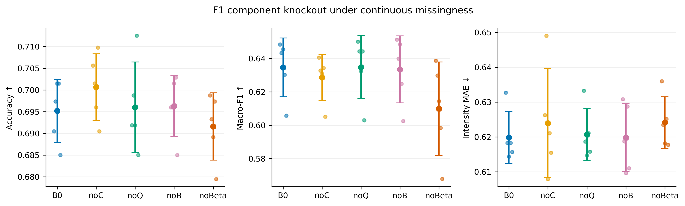
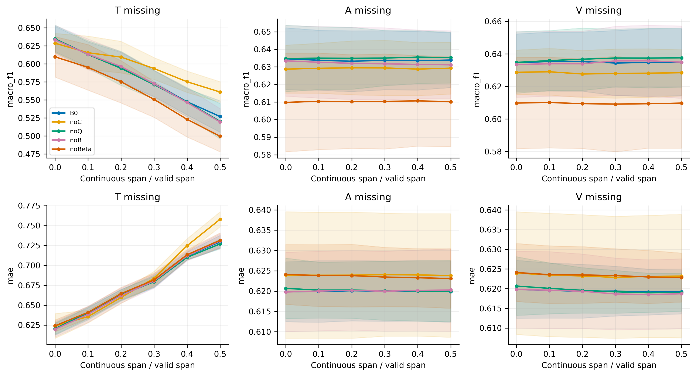
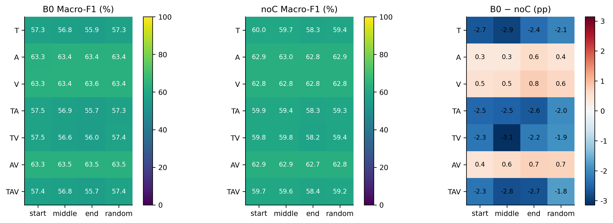
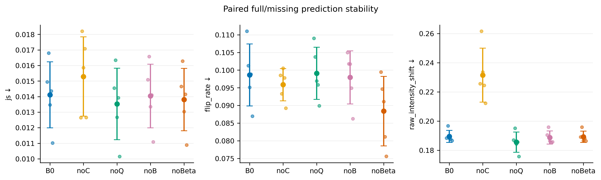
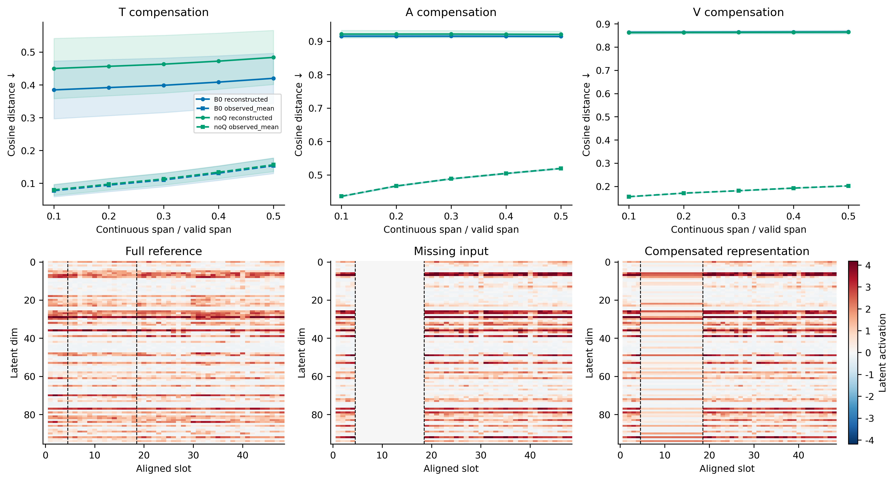

# 图表说明

主图为组件拆除与鲁棒性；辅助图为稳定性与补全质量。误差区间为跨训练seed标准差。

## 01_ablation: F1组件拆除主结果

图类型/内容：点区间图；横轴实验组，纵轴ACC、Macro-F1、强度MAE。

图注：B0为完整F1。noC拆除补全，noQ拆除可靠性q，noB拆除边界损失，noBeta拆除类别平衡。主结果为完整输入test（无额外人工遮挡）；各组在同一条件下对照。点为训练seed，区间为跨seed均值±标准差。

论证目标：检验正式F1各组件在完整输入下的独立贡献。

## 02_robustness: 连续缺失跨度与鲁棒性

图类型/内容：三列T/A/V缺失；上排Macro-F1，下排MAE；横轴缺失跨度。

图注：各组共享相同缺失区间。0%点为各组完整输入性能。随机掩码重复在每个训练seed内先平均；阴影为跨seed标准差。

论证目标：检验拆除收益/损失是否随缺失严重程度变化。

## 03_location: 缺失模态与位置

图类型/内容：热力图；行是七种模态组合，列是位置；显示B0、noC及B0−noC。

图注：固定主缺失比例。随机位置重复先合并；绝对性能共用色标，差值以0为中心，单位百分点。

论证目标：定位补全模块在何种场景贡献最大。

## 04_stability: 完整与缺失视图稳定性

图类型/内容：点区间图；横轴模型，纵轴JS散度、极性翻转率、原始强度变化。

图注：同模型同样本配对比较完整与缺失视图。强度用未投影原始输出。先合并掩码重复再对模态等权。

论证目标：检验拆除组件是否加剧完整/缺失预测不一致。

## 05_reconstruction: 补全质量（仅含补全的组）

图类型/内容：上排T/A/V缺失跨度与余弦距离；下排中位误差样本热力图。

图注：只评价人工遮挡且原本可观测的槽。完整参考来自同一模型。观测均值对照仅用缺失视图可见特征。样本取B0首个seed中位误差。

论证目标：检验补全是否比观测均值更接近完整表示；接近不自动等于任务增益。

