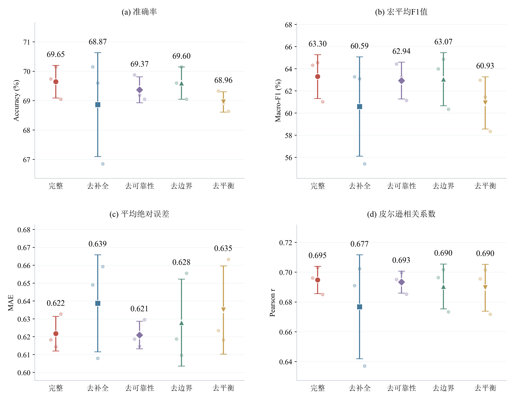
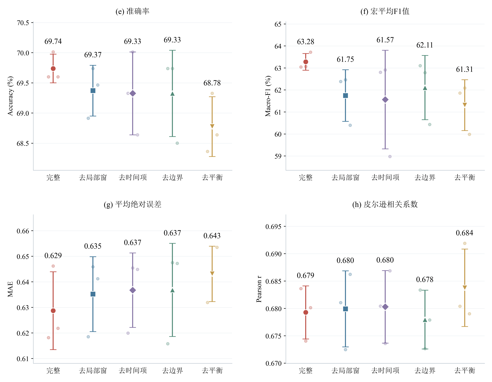
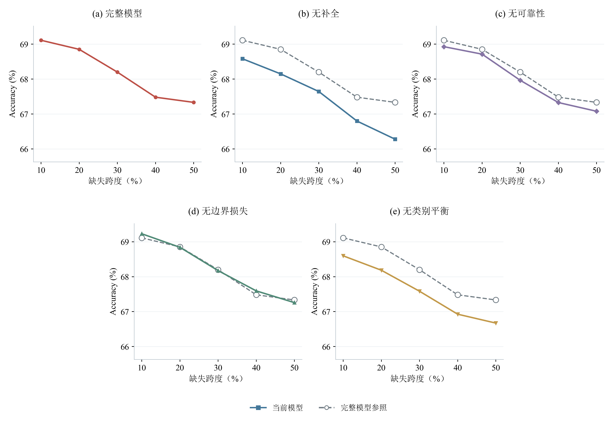
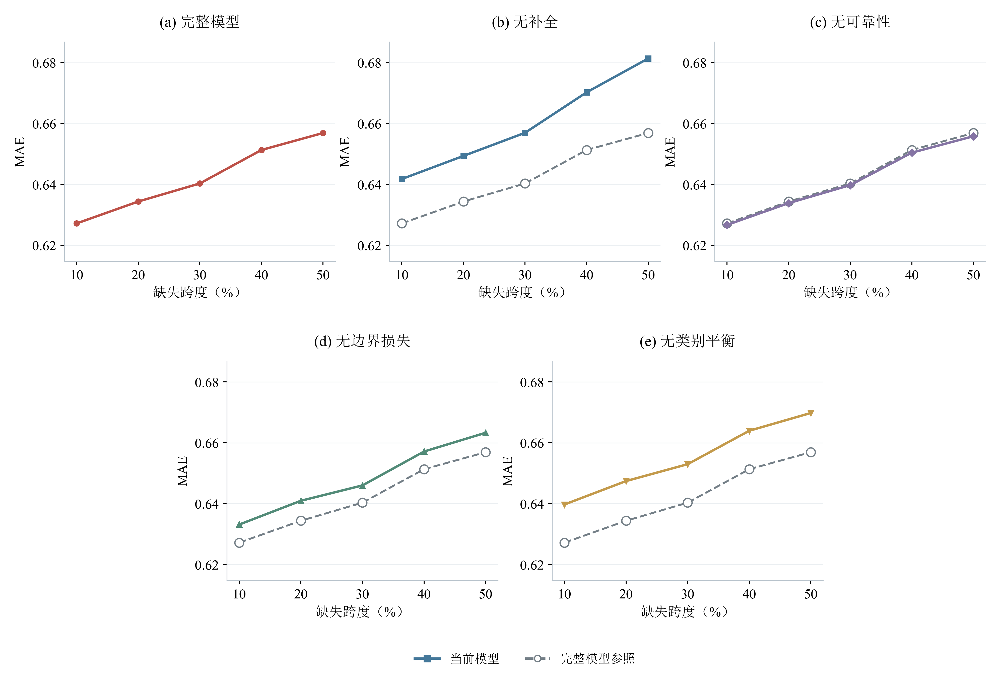
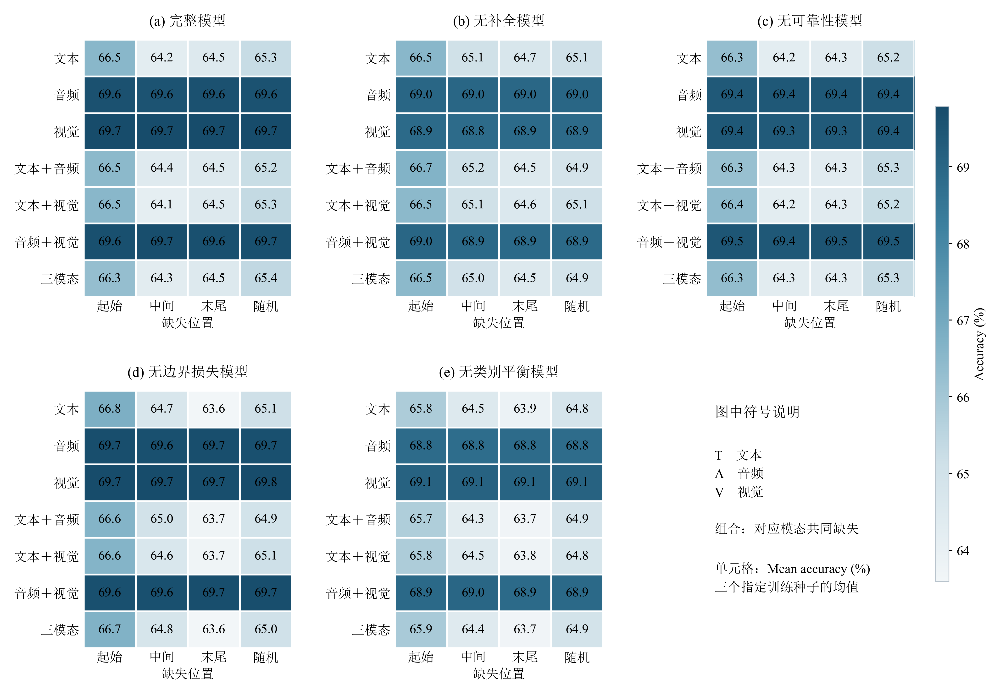
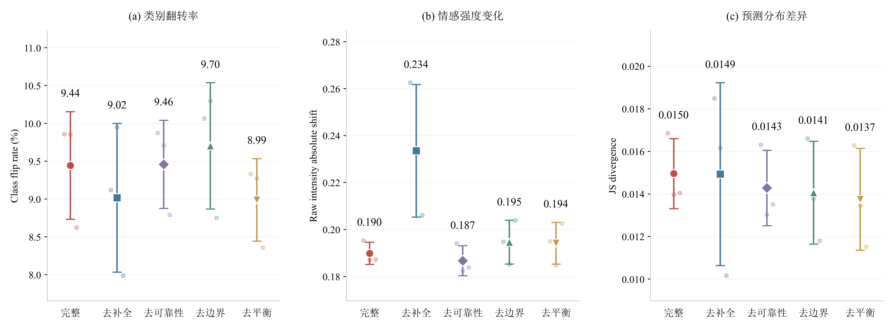
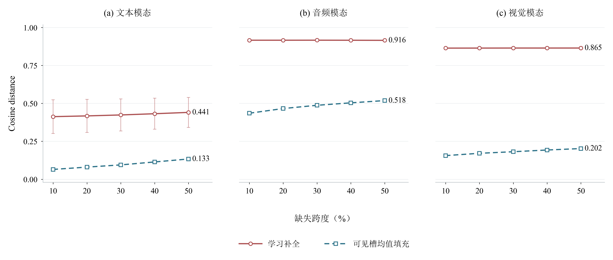
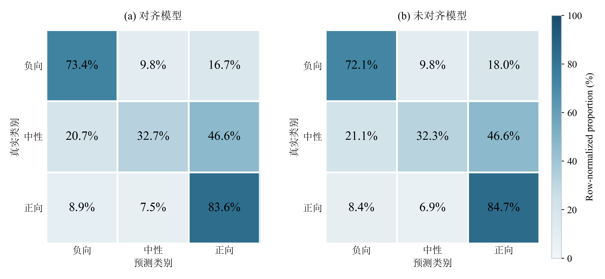

# 基于现有代码与实际实验的消融分析

本报告只使用已经完成的实验，重新生成下列八张图，不复用旧图片，不把旧实验改名为尚未实现的六组增量实验。

## 现有模型与真实实验组

| 组别 | 对齐版含义 | 未对齐版含义 |
|---|---|---|
| B0 | 补全＋可靠性＋模态门控＋边界损失＋类别平衡 | 连续单调局部窗＋窗内软注意力＋时间惩罚＋模态门控＋边界损失＋类别平衡 |
| noC | 关闭观测条件补全 | 取消连续局部窗，使用全局软注意力 |
| noQ | 关闭补全可靠性调制 | 关闭时间惩罚 |
| noB | 关闭中性边界损失 | 关闭中性边界损失 |
| noBeta | 关闭类别频数平衡 | 关闭类别频数平衡 |

**同名noC/noQ在两种布局中的含义不同，不能横向解释成相同模块。** 当前没有独立一致性约束组、拼接缺失基线或显式重构损失组；所有变体都保留模态门控，所以现有消融不能单独证明门控有效。

## 数据与统计口径

对齐seed：**2027、2028、2035**；未对齐seed：**2026、2031、2033**。来自两个原始实验批次的逐seed记录，而非旧的筛选汇总表。五个变体在各自布局中使用同一组三个seed。完整输入共30份逐样本预测文件，均核对727个唯一ID，准确率与metrics.csv一致。
现存历史报告明确记录过依据测试结果重选seed；本报告按用户指定集合报告，属于选定子集的描述性统计，不能作为未筛选重复实验的显著性证据，也不与此前五seed标准差直接比较。
均值与误差条均在训练seed层级计算，标准差ddof=1（n=3，分母2）；随机位置的三个mask seed（5026/5027/5028）先在每个训练seed内平均，不当作额外训练重复。未对齐五组现有记录只有完整输入，因此连续缺失相关图仅绘对齐结果。MAE来自现存预测文件的极性投影后强度；稳定性图明确使用原始回归输出。

## 主图1：完整输入性能与组件拆除

**类型/坐标：** 对齐、未对齐分别绘制一张2×2点区间图，横轴为五个实际变体，纵轴分别为Accuracy、Macro-F1、MAE和Pearson r。各面板独立确定纵轴范围。

**图注：** 图1 完整测试输入下的组件拆除实验。B0为各布局的完整模型，noC/noQ/noB/noBeta的具体含义见上表。大点为三个指定训练seed的均值，误差条为±1样本标准差，浅色小点为单seed成绩；上方数值标注对应均值。横轴采用简写：“去边界”为去边界损失，“去平衡”为去类别平衡，“去时间项”为去时间惩罚；完整组名见表。所有组测试样本数均为727。ACC与Macro-F1越高越好，MAE越低越好。对齐和未对齐的seed集合不同，因此两张图不构成同seed配对比较。该图检验组件对完整输入任务性能的贡献，不单独证明缺失鲁棒性。

| 布局 | 组别 | ACC均值±SD | Macro-F1均值±SD | MAE均值±SD | Pearson均值±SD |
|---|---|---:|---:|---:|---:|
| aligned | B0 | 69.65% ± 0.56个百分点 | 63.30% ± 1.98个百分点 | 0.6218 ± 0.0097 | 0.6948 ± 0.0092 |
| aligned | noC | 68.87% ± 1.77个百分点 | 60.59% ± 4.49个百分点 | 0.6387 ± 0.0272 | 0.6768 ± 0.0349 |
| aligned | noQ | 69.37% ± 0.44个百分点 | 62.94% ± 1.66个百分点 | 0.6210 ± 0.0077 | 0.6934 ± 0.0074 |
| aligned | noB | 69.60% ± 0.55个百分点 | 63.07% ± 2.40个百分点 | 0.6280 ± 0.0243 | 0.6905 ± 0.0150 |
| aligned | noBeta | 68.96% ± 0.35个百分点 | 60.93% ± 2.36个百分点 | 0.6350 ± 0.0247 | 0.6896 ± 0.0157 |
| unaligned | B0 | 69.74% ± 0.24个百分点 | 63.28% ± 0.38个百分点 | 0.6287 ± 0.0152 | 0.6793 ± 0.0049 |
| unaligned | noC | 69.37% ± 0.42个百分点 | 61.75% ± 1.17个百分点 | 0.6352 ± 0.0146 | 0.6799 ± 0.0069 |
| unaligned | noQ | 69.33% ± 0.69个百分点 | 61.57% ± 2.24个百分点 | 0.6368 ± 0.0145 | 0.6803 ± 0.0066 |
| unaligned | noB | 69.33% ± 0.71个百分点 | 62.11% ± 1.46个百分点 | 0.6369 ± 0.0182 | 0.6780 ± 0.0054 |
| unaligned | noBeta | 68.78% ± 0.50个百分点 | 61.31% ± 1.16个百分点 | 0.6431 ± 0.0108 | 0.6838 ± 0.0071 |

**论证目标与实际结论：** 指定seed子集内B0的完整输入平均ACC高于各拆除组；差距大小见表。不能据此断言未筛选种子总体同样成立，也不能把很小的差距称为统计显著。

## 主图2：连续缺失时长与预测性能

**类型/坐标：** Accuracy、MAE各一张折线图，每张第一行三面板、第二行两面板居中，五个面板大小相同、共用纵轴范围；横轴为10/20/30/40/50%的连续缺失跨度。各拆除模型只与完整模型参照比较，不再叠加五组曲线。

**图注：** 图2 对齐模型在单模态随机连续缺失下的性能。每个seed、每个跨度先平均三个随机掩码重复，再对T/A/V三种单模态缺失等权平均；彩色实线为当前模型三个训练seed的均值，灰色虚线和空心圆为完整模型B0的均值参照；B0列不重复画参照线。本图不绘阴影或误差条，以突出均值趋势；这不表示训练波动为零，逐seed结果保存在plot_data/duration_by_seed.csv。两线重合表示实际均值接近，未通过平移数据制造间距。各变体使用相同场景定义。横轴为标称有效时间跨度，受取整及保留观测规则影响，不等同于精确删除观测比例。组合模态在现有记录中只有30%跨度，因此不将其混入本图，也不外推70%结果。

**论证目标：** 检验组件的贡献是否随连续缺失时长改变，并同时观察绝对性能和退化趋势；不能只依据曲线下降较慢判定某模型更好。

## 主图3：缺失模态与位置的敏感性

**类型/坐标：** 五张绝对性能热力图；横轴为起始/中间/末尾/随机，纵轴为缺失模态组合。所有面板的颜色与数字均表示Accuracy（%）。

**图注：** 图3 对齐模型在30%连续缺失下的场景级准确率。T/A/V分别为文本、音频、视觉，多模态组合使用同一相对时间段的缺失。随机位置先平均三个掩码重复，各格再平均三个训练seed。五张热力图共享同一准确率色标，可直接比较相同场景中的模型表现；颜色不代表统计显著性。该图仅包含现有实测场景，不含完整输入参考；平均值不表示每个seed均有相同排序。

**论证目标：** 找到对模型影响最大的模态组合与缺失位置，并检查完整模型是否在所有场景都占优；负面场景也完整保留。

## 辅助图4：完整—缺失输出稳定性

**类型/坐标：** 三面板竖向点区间图，横轴为实际变体，纵轴分别为Class flip rate、Raw intensity absolute shift、JS divergence；误差条为±1样本标准差，上方彩色数值为均值（翻转率保留两位小数、强度漂移三位、JS散度四位），与主图1的标注样式一致。

**图注：** 图4 对齐模型在30%缺失场景下的输出变化。每个模型以自身完整输入预测为参照，比较同一样本缺失输入的类别、原始回归值和分类分布；不是与另一个模型的输出比较。每个seed先平均随机掩码重复，再对四种位置及七种缺失组合等权平均；大点和误差条为三个seed的均值±样本标准差。三项均越低表示输出变化越小，但恒定错误预测也可能稳定，因此须结合图1–3的准确率判断。本代码未训练一致性约束，这张图是行为诊断，不是一致性损失的消融证明。

## 辅助图5：现有补全表示的质量

**类型/坐标：** 文本、音频、视觉横向并列的三个折线图；横轴为单模态随机连续缺失跨度，纵轴为Cosine distance。实线圆点表示学习补全，虚线菱形表示可见槽均值填充。三幅面板共用相同纵轴，下方为统一图例；50%缺失处标出均值。

**图注：** 图5 对齐B0的学习补全表示与可见槽均值填充的离线比较。评分只覆盖原先可观测而被人工删除的槽，排除padding及原始无效槽；参照为同一B0模型在完整输入下的投影特征。简单基线对每条样本当前仍可见的同模态投影特征求均值，并填入缺失位置。目标完整特征只用于离线评分，不送入缺失推理。每个点先平均三个mask seed，再报告三个训练seed的均值；圆点为学习补全，菱形为可见槽均值填充，彩色细误差条表示±1样本标准差。同一方法在不同缺失跨度的均值用折线连接；本图不绘阴影。50%缺失处的数字为该位置的均值；三种模态共享纵轴范围，余弦距离越低越好。本指标来自现存reconstruction.csv，是中间补全输出的相似度，不等同于最终可靠性调制后的表示，也不等同于显式重构监督损失。

**论证目标：** 检查现有补全是否优于简单可见均值；即使任务ACC有所提高，也不预设补全的余弦质量更好。

## 辅助图6：完整模型的类别错误结构

**类型/坐标：** 两张混淆矩阵，横轴预测类别、纵轴真实类别；两图共享0–100%色标。

**图注：** 图6 对齐及未对齐B0在完整test上的分类混淆矩阵。各seed分别计算按真实类别行归一化的矩阵，再对该布局的三个指定seed求平均；每行总和100%。对角线表示类别召回率，非对角线表示错误去向。类别顺序负、中、正；两布局使用同一测试样本划分，但seed不同。此图使用完整输入结果，不能解释为缺失测试的中性召回率。

**论证目标：** 查看总体准确率背后是否存在中性识别不足，避免用ACC掩盖类别差异。

## 图组关系与复现

图1给出当前真实消融的整体性能，图2和图3分别分解缺失时长、模态和位置；图4解释输出变化，图5检验补全表示是否真的相似，图6揭示类别错误结构。这套图不声称验证当前代码没有实现的模块。
运行：`conda run -n CPMCM python "problem2_retrain_v2 copy/生成现有实验图表.py"`。无需训练、无需GPU，重新从原始结果生成PNG/PDF、统计表和本报告。
绘图输入副本与seed级聚合在`plot_data/`；源文件SHA与指定seed在`plot_data/provenance.json`，便于追溯。

补全诊断（T，五个跨度等权）：学习补全余弦距离0.4253，可见均值0.0974；较低者为可见均值。

补全诊断（A，五个跨度等权）：学习补全余弦距离0.9162，可见均值0.4822；较低者为可见均值。

补全诊断（V，五个跨度等权）：学习补全余弦距离0.8647，可见均值0.1806；较低者为可见均值。

aligned完整输入中性召回率：32.70%。

unaligned完整输入中性召回率：32.28%。

验证集上的选模、参数与阈值分析见[补充报告](验证集选模与参数分析.md)。
