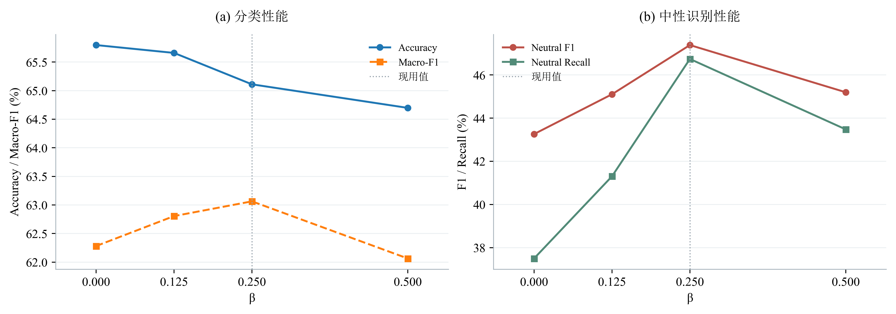
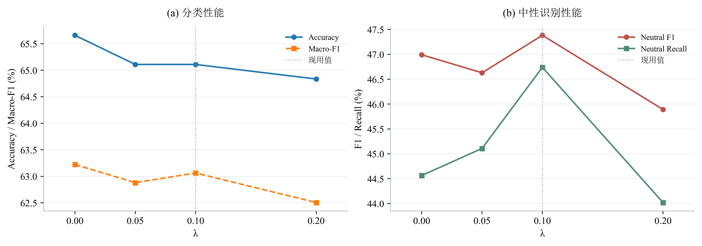
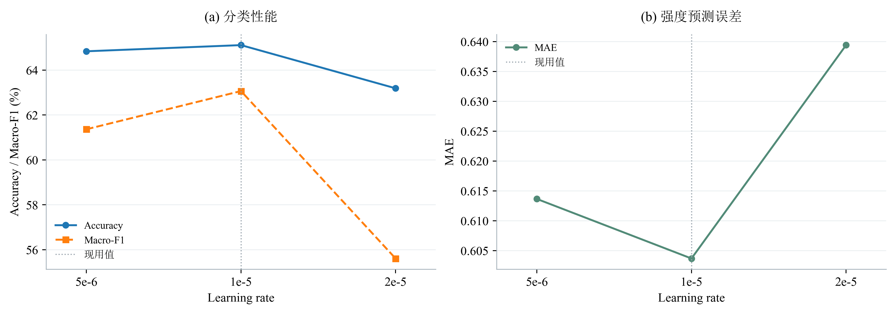

# 对齐模型的三项超参数敏感性分析

本节仅分析对齐模型，固定seed=2026，考察类别平衡强度β、边界损失最大权重λ和BERT初始学习率。当前方案保持 **β=0.25、λ=0.1、BERT学习率=1e-5**。

## 实验设置与分析口径

参数只在附件2训练集上学习，以下指标来自验证集。每次只改变一项参数，其余保持现用配置；三项扫描共用一个默认组，因此共9个独立训练配置。最多训练12轮、patience=4，沿用相同的数据、共享投影初始化及连续缺失掩码。没有新增训练或使用test挑选参数。

训练检查点仍按原规则S=0.7×完整验证Accuracy+0.3×三模态连续30%缺失验证Accuracy选择。以下从题目要求的Accuracy、F1、MAE、Pearson及中性漏判问题解释现用参数的取舍，**没有另设或倒推一个综合分数来宣称现用值最优**。中性F1和Recall是解释性指标，不是新增的题目评分标准。

所有F1均注明口径：Macro-F1衡量三类的宏平均表现，Neutral F1仅衡量中性类；回归指标沿用当前输出协议的极性一致性投影强度。单seed曲线不画误差棒或阴影，跨seed稳定性留待后续评估。

## 1. 类别平衡强度

### 作用：纠正类别不平衡，而非把所有模糊样本推向中性

训练集负向、中性、正向样本分别为967、758、1670条，占28.48%、22.33%、49.19%。若各样本同权，数量较多的正向样本对训练目标的总贡献更大。因此使用由训练集频数决定的类别权重：

$$w_c=\frac{(N/(3n_c))^\beta}{\sum_j(n_j/N)(N/(3n_j))^\beta},\qquad
\mathcal L_{cls}=\frac{\sum_i w_{y_i}\ell_i}{\sum_i w_{y_i}}.$$

其中，$\ell_i$为代码采用的标签平滑交叉熵。归一化控制损失尺度，β控制纠偏强度：β=0等权，β越大，少数类相对权重越高。

### 为什么现用β=0.25

β=0.25时，负/中/正权重约为 **1.051、1.117、0.917**，中性相对正向的权重比约为1.218；β=0.5时该比值增至约1.484。因而0.25是在给予少数类额外学习机会的同时，避免过强重加权改变原有分类边界的温和设置。

对齐实验提供了具体支持：相较β=0，β=0.25使完整验证中性Recall从 **37.50%提升至46.74%**，Macro-F1从 **62.28%提升至63.06%**。它在本次四个取值中取得最高的中性F1、中性Recall和Macro-F1。题目不仅要求整体Accuracy，也使用F1评价极性预测；结合本研究要改善中性漏判的问题，保留0.25具有明确的任务依据。

这一收益伴随取舍：完整Accuracy从65.80%降至65.11%，局部30%缺失Accuracy从60.30%降至59.89%，中性Precision也略降。进一步增至β=0.5并未继续改善完整验证中性Recall或Macro-F1。因此，**0.25是偏重各类别均衡识别、兼顾整体分类性能的折中值，而不是Accuracy最高的取值**。



**图注：** 对齐模型、seed=2026。横轴为β；左图比较完整验证集Accuracy和Macro-F1，右图展示完整验证中性F1和Recall（越高越好）。竖向虚线标出现用取值，每个点对应一次真实训练并按同一规则选择检查点。连线仅便于比较已测候选，不表示中间值经过实验。

| 取值 | Accuracy (%) | Macro-F1 (%) | Neutral F1 (%) | Neutral Recall (%) | MAE | Pearson r | Local30 Accuracy (%) | S (%) |
|---:|---:|---:|---:|---:|---:|---:|---:|---:|
| 0 | 65.797 | 62.282 | 43.260 | 37.500 | 0.606 | 0.664 | 60.302 | 64.148 |
| 0.125 | 65.659 | 62.806 | 45.104 | 41.304 | 0.602 | 0.665 | 60.440 | 64.093 |
| 0.25 | 65.110 | 63.063 | 47.383 | 46.739 | 0.604 | 0.668 | 59.890 | 63.544 |
| 0.5 | 64.698 | 62.064 | 45.198 | 43.478 | 0.604 | 0.657 | 61.264 | 63.668 |

## 2. 边界损失权重

### 作用：区分真实中性与弱正、弱负

类别重加权解决的是“哪一类获得多少训练关注”，不能直接保证真实中性与弱极性样本在表示空间或决策分数上分离。为此定义中性相对极性分数：

$$r_i=z_{i,N}-\log(\exp z_{i,-}+\exp z_{i,+}).$$

对批内真实中性样本$i$及弱极性样本$j$（$0<|y_j|\leq0.5$），采用：

$$\mathcal L_{boundary}=\frac{1}{|\mathcal N||\mathcal W|}
\sum_{i\in\mathcal N}\sum_{j\in\mathcal W}
\operatorname{softplus}(m-r_i+r_j),\quad m=0.5.$$

该项对$r_i$的导数为负，对$r_j$的导数为正，优化时提高真实中性的相对分数、压低弱极性的中性分数。λ决定该辅助目标对训练的影响：

$$\mathcal L_{full}=\mathcal L_{cls}+0.2\mathcal L_{Huber}+0.1\mathcal L_{ordinal}
+\lambda_e\mathcal L_{boundary},\qquad
\lambda_e=\lambda_{max}\min(1,e/3).$$

代码仅在完整视图施加边界项；连续缺失视图保留分类、回归及有序辅助监督，避免证据被删除后仍强制满足完整证据下的边界排序。两个视图的损失联合训练。图中λ指配置的最大权重λ_max，前三轮逐步增大到该值。

### 为什么现用λ=0.1

设为0会关闭这项直接针对中性边界的约束；过大则可能让辅助排序过多干预分类与强度回归。0.1保留适度边界监督，并通过预热减少训练初期的突变。这里的“0.1”是系数，不能解释为边界项必然占总损失的10%。

对齐实验中，λ=0.1的中性Recall为 **46.74%**，高于λ=0的44.57%、λ=0.05的45.11%及λ=0.2的44.02%；中性F1也在这四个取值中最高。相较关闭边界项，现用值的完整验证MAE约从 **0.606降至0.604**，Pearson由 **0.665升至0.668**，说明在本次测量中，它兼顾了中性召回和情感强度预测。

λ=0仍有更高的完整Accuracy和略高的Macro-F1，故不能声称0.1全面占优；但将λ增加到0.2又使完整Accuracy、Macro-F1、中性Recall和回归表现下降。综合题目要求的分类与回归双任务，以及针对中性边界的建模目的，**保留0.1作为适度辅助约束**，比单纯追求某一项Accuracy更符合当前方法的设计取向。



**图注：** 对齐模型、seed=2026。横轴为λ；左图比较完整验证集Accuracy和Macro-F1，右图展示完整验证中性F1和Recall（越高越好）。竖向虚线标出现用取值，每个点对应一次真实训练并按同一规则选择检查点。连线仅便于比较已测候选，不表示中间值经过实验。

| 取值 | Accuracy (%) | Macro-F1 (%) | Neutral F1 (%) | Neutral Recall (%) | MAE | Pearson r | Local30 Accuracy (%) | S (%) |
|---:|---:|---:|---:|---:|---:|---:|---:|---:|
| 0 | 65.659 | 63.222 | 46.991 | 44.565 | 0.606 | 0.665 | 60.165 | 64.011 |
| 0.05 | 65.110 | 62.880 | 46.629 | 45.109 | 0.603 | 0.667 | 60.027 | 63.585 |
| 0.1 | 65.110 | 63.063 | 47.383 | 46.739 | 0.604 | 0.668 | 59.890 | 63.544 |
| 0.2 | 64.835 | 62.506 | 45.892 | 44.022 | 0.608 | 0.662 | 59.753 | 63.310 |

## 3. BERT微调学习率

### 作用：使通用BERT适应当前任务，同时控制参数更新幅度

本模型在附件2训练集上全量微调通用BERT，学习率影响预训练文本表示适应情感任务的速度和幅度。过小可能在有限训练预算内适应不足，过大可能带来过强更新；后者是机制上的风险，不能仅凭终点指标断言发生了“灾难性遗忘”。

本次考察的是 **BERT参数组的初始学习率**，新建多模态模块的初始学习率固定为$10^{-4}$，两组均沿用原训练调度策略。扫描$5\times10^{-6}$、$10^{-5}$、$2\times10^{-5}$，分别比较当前值的一半、当前值与两倍。

### 为什么现用学习率为1e-5

在统一训练预算下，1e-5的完整验证Accuracy为 **65.11%**、Macro-F1为 **63.06%**，均高于5e-6的64.84%、61.36%，也高于2e-5的63.19%、55.61%。同时，1e-5的MAE约为 **0.604**、Pearson约为 **0.668**，在三个候选中分别最低、最高。

局部30%缺失Accuracy在5e-6时略高（60.30%，1e-5为59.89%），但原有完整/缺失验证Accuracy加权分数仍由1e-5取得最高。因而，**1e-5在文本任务适应、完整输入分类以及强度回归之间有更充分的综合验证支持**。它是在当前架构和训练预算下的选择，不等同于对任意训练轮数、任意seed都最优。



**图注：** 对齐模型、seed=2026。横轴为Learning rate；左图比较完整验证集Accuracy和Macro-F1，右图展示完整验证MAE（越低越好）。竖向虚线标出现用取值，每个点对应一次真实训练并按同一规则选择检查点。连线仅便于比较已测候选，不表示中间值经过实验。

| 取值 | Accuracy (%) | Macro-F1 (%) | Neutral F1 (%) | Neutral Recall (%) | MAE | Pearson r | Local30 Accuracy (%) | S (%) |
|---:|---:|---:|---:|---:|---:|---:|---:|---:|
| 5e-06 | 64.835 | 61.363 | 42.633 | 36.957 | 0.614 | 0.653 | 60.302 | 63.475 |
| 1e-05 | 65.110 | 63.063 | 47.383 | 46.739 | 0.604 | 0.668 | 59.890 | 63.544 |
| 2e-05 | 63.187 | 55.609 | 26.190 | 17.935 | 0.639 | 0.633 | 60.165 | 62.280 |

## 现用参数的整体考虑

**β控制不同类别在训练目标中的相对地位，λ直接约束中性与弱极性的决策边界，学习率控制预训练文本编码器的更新幅度。** 三者承担不同职责：先避免多数类主导，再处理相邻情感类别混淆，同时保持分类与强度回归的有效学习。

对齐实验中，β=0.25和λ=0.1分别在对应扫描中取得最高的中性F1与Recall；β=0.25还取得该扫描最高的Macro-F1。学习率1e-5则在其扫描中兼顾完整分类与回归表现。因此当前取值有任务目标和实际指标两方面的依据，但β、λ的保留包含对中性识别的明确偏重，不能写成它们使所有指标或原S同时最优。

## 运行与数据

仅重新生成这三张图和本文：

```bash
conda run -n CPMCM python "problem2_retrain_v2 copy/超参敏感性实验.py" --report-only
```

去掉`--report-only`可执行对齐版三参数扫描，默认seed=2026；已完成且配置、检查点一致的运行会跳过。`--aligned-device`指定设备，`--workers`指定并发进程数。此入口不再安排其他数据布局、窗口参数或联合参数训练。

绘图数据：[aligned_three_parameter_validation.csv](sensitivity_results/aligned_three_parameter_validation.csv)。图以PNG、PDF保存；中文宋体，英文及数字Times New Roman。此前扩展实验的原始记录保留作归档，不纳入本节结论。
