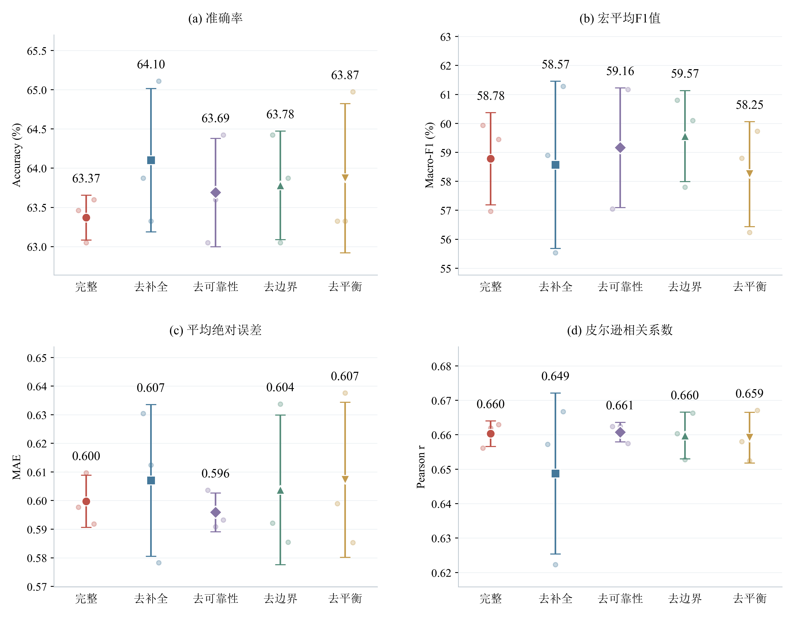
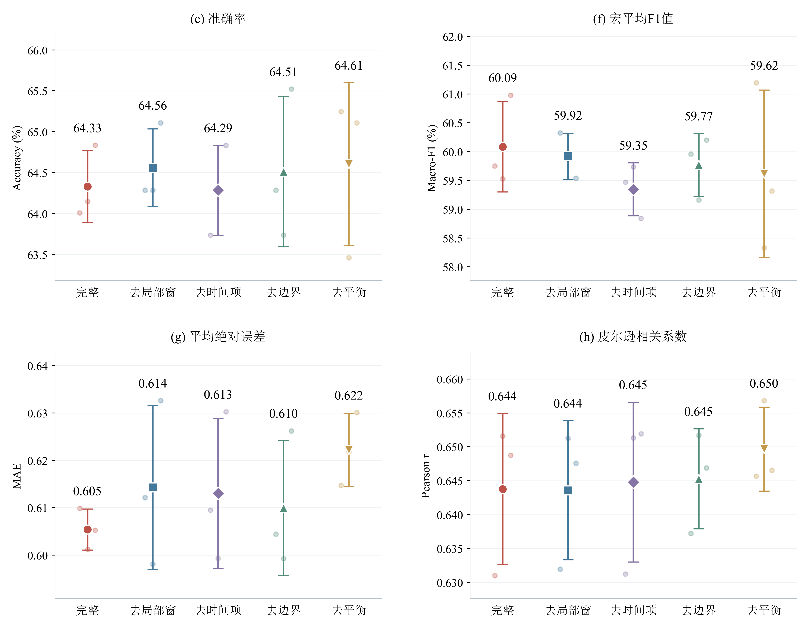
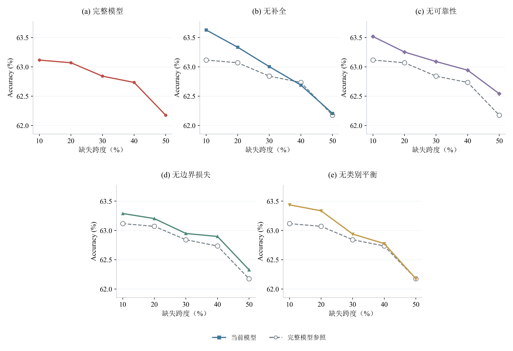
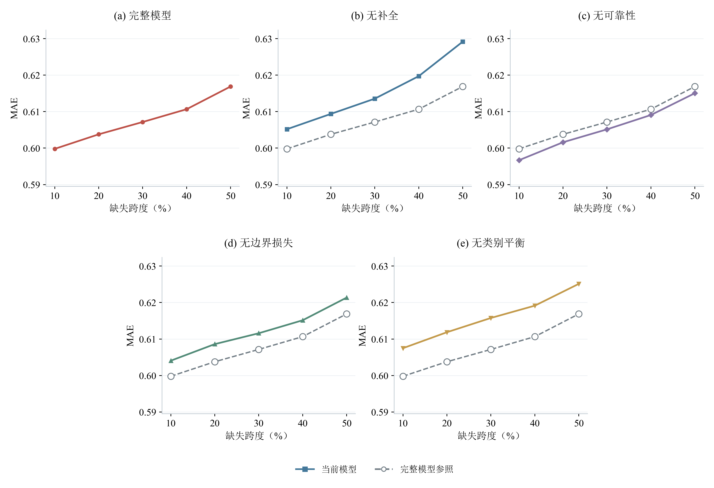
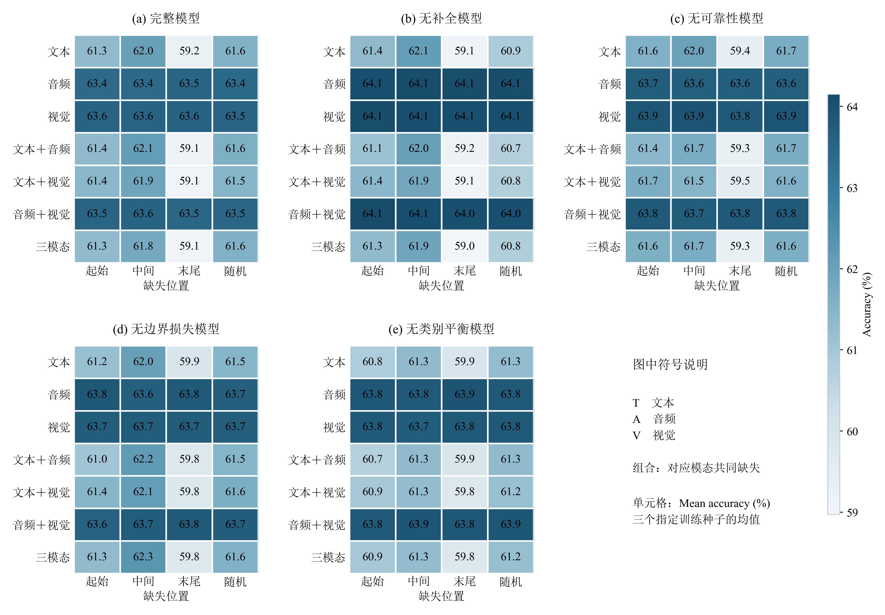
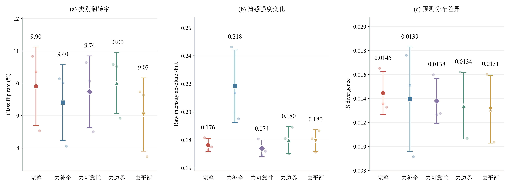
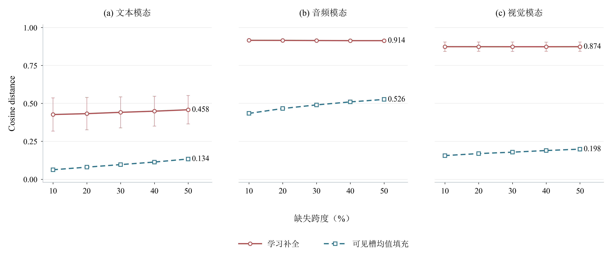
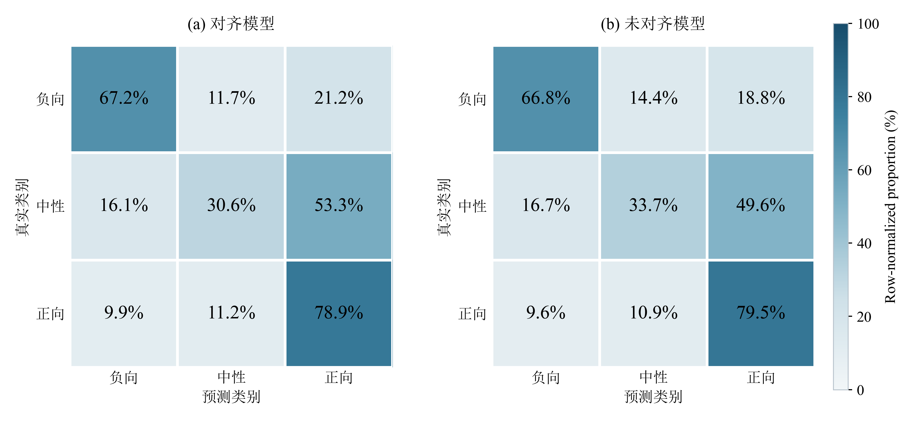

# 对齐模型的验证集实验与六类实验分析图

使用已保存的对齐消融模型，在附件2验证集上补做完整输入及连续局部缺失推理，不重新训练、不使用test或无标签专项数据计算指标。对齐模型训练seed为2027、2028、2035；未对齐完整输入消融使用2026、2031、2033，均与对应测试图一致。未对齐四项指标从已保存的728条完整验证预测重新计算，缺失场景分析仍针对对齐模型；超参数分析另用seed=2026，两者分开呈现。

## 实验与统计口径

| 组别 | 对齐版 | 未对齐版 |
|---|---|---|
| B0 | 保留全部现有模块 | 保留全部现有模块 |
| noC | 关闭观测条件补全 | 取消连续局部窗 |
| noQ | 关闭补全可靠性调制 | 关闭时间惩罚 |
| noB | 关闭中性边界损失 | 关闭中性边界损失 |
| noBeta | 关闭类别频数平衡 | 关闭类别频数平衡 |

各组均保留模态门控；当前实验并非六组增量消融，不能据此单独证明门控、一致性损失或显式重构损失的贡献。

验证集共728个唯一样本。完整输入指未额外注入人工缺失，仍保留数据本身的有效观测掩码。局部缺失沿有效时间轴遮去连续区间，不表示整个模态消失。各组共享缺失掩码：随机位置mask seed为5026、5027、5028，起始/中间/末尾位置使用固定场景。

场景共78个：T/A/V单模态在10%、20%、30%、40%、50%跨度下随机连续缺失；T、A、V、TA、TV、AV、TAV七种集合在30%跨度下比较起始、中间、末尾和随机位置。随机掩码先在训练seed内部平均，模型间统计再取三个训练seed的均值和样本标准差（ddof=1）；三个mask seed不是三个独立训练重复。

推理统一使用float32、最高float32矩阵计算精度及batch_size=64，完整预测与历史验证摘要逐项核对；若旧推理设置下的临界样本类别与本次不同，单独记录差异，本报告统一使用本次推理结果。各模型在验证集上选过检查点，因此这些图用于验证集上的选模、鲁棒性和机制诊断，不等同于独立测试性能。

分类报告Accuracy、Macro-F1；回归报告MAE、Pearson。MAE及Pearson使用当前输出协议的极性一致性投影强度，稳定性图另用原始回归输出，二者不混用。

## 主图1：完整验证输入的组件消融





**图类型与坐标：** 对齐、未对齐各一张2×2四面板点区间图。横轴是五个实际模型组，纵轴依次为Accuracy、Macro-F1、MAE、Pearson r。

**图注：** 每个大点为三个训练seed的均值，浅色小点为各seed实测值，误差棒为±1个样本标准差，上方标注均值。每次推理均使用同一验证集的728个样本；本图不额外注入缺失。Accuracy、Macro-F1和Pearson越高越好，MAE越低越好。

**论证目标：** 检查模块拆除如何影响常规验证表现，并同时观察分类与强度回归的取舍。

| 组别 | Accuracy (%) | Macro-F1 (%) | MAE | Pearson r |
|---|---:|---:|---:|---:|
| 完整模型 | 63.370 ± 0.286 | 58.783 ± 1.593 | 0.600 ± 0.009 | 0.660 ± 0.004 |
| 无补全 | 64.103 ± 0.915 | 58.573 ± 2.887 | 0.607 ± 0.027 | 0.649 ± 0.023 |
| 无可靠性 | 63.690 ± 0.691 | 59.164 ± 2.063 | 0.596 ± 0.007 | 0.661 ± 0.003 |
| 无边界损失 | 63.782 ± 0.691 | 59.567 ± 1.570 | 0.604 ± 0.026 | 0.660 ± 0.007 |
| 无类别平衡 | 63.874 ± 0.952 | 58.252 ± 1.810 | 0.607 ± 0.027 | 0.659 ± 0.007 |

未对齐完整输入消融（同样为2×2四指标图）：

| 组别 | Accuracy (%) | Macro-F1 (%) | MAE | Pearson r |
|---|---:|---:|---:|---:|
| 完整模型 | 64.332 ± 0.442 | 60.086 ± 0.782 | 0.605 ± 0.004 | 0.644 ± 0.011 |
| 无局部窗 | 64.560 ± 0.476 | 59.920 ± 0.395 | 0.614 ± 0.017 | 0.644 ± 0.010 |
| 无时间惩罚 | 64.286 ± 0.549 | 59.348 ± 0.460 | 0.613 ± 0.016 | 0.645 ± 0.012 |
| 无边界损失 | 64.515 ± 0.915 | 59.773 ± 0.544 | 0.610 ± 0.014 | 0.645 ± 0.007 |
| 无类别平衡 | 64.606 ± 0.994 | 59.616 ± 1.455 | 0.622 ± 0.008 | 0.650 ± 0.006 |

**实际结果：** 完整验证Accuracy均值最高的是无补全（64.10%）。其他指标见表；不因B0是完整模型就预设它在每个指标上都最好。

## 主图2：连续缺失时长与性能退化





**图类型与坐标：** Accuracy与MAE分别绘制一张折线图；每张第一行三个模型、第二行两个模型居中排列，横轴为人工连续缺失跨度10%—50%。

**图注：** 仅比较T/A/V单模态随机连续缺失；每个训练seed先平均三个mask seed，再等权平均三个缺失模态，最后对三个训练seed取均值。彩色线是当前模型，灰色虚线是相同场景下的B0参照。不给组合模态补造未评估的跨时长网格；图中不使用阴影。

**论证目标：** 比较连续缺失加长时的性能变化，并判断哪些模块有助于减缓退化。曲线波动按实测保留，不强制平滑或单调。

**实际结果：** B0从10%到50%缺失的Accuracy为63.12%→62.17%，MAE为0.600→0.617。

## 主图3：缺失模态与缺失位置



**图类型与坐标：** 五模型热图。横轴为起始、中间、末尾、随机位置，纵轴为七种缺失模态集合，颜色和格内数字表示Accuracy。

**图注：** 人工缺失跨度固定30%；T、A、V分别表示文本、音频、视觉，组合表示相应模态在匹配的连续时段共同缺失。随机位置先平均三个mask seed，各单元格再平均三个训练seed。所有子图共用色标，格内数字为百分比。

**论证目标：** 分离缺失类型和位置的影响，识别最敏感场景；不把位置效应与缺失时长混为一谈。

## 辅助图4：完整—缺失预测稳定性



**图类型与坐标：** 横向三面板点区间图，横轴为模型组，纵轴分别为类别翻转率、原始强度绝对变化及JS散度。

**图注：** 固定30%缺失，每个样本与同一模型在完整输入下的预测比较。随机掩码先平均，再等权平均位置及七种模态集合；大点和误差棒分别表示三个训练seed的均值与样本标准差，并标出均值。类别翻转率比较argmax类别；强度变化为原始回归输出绝对差；JS比较完整与缺失的三类概率分布。三者均越低越稳定。

**论证目标：** 观察预测对局部信息扰动的敏感程度。稳定不等于正确，必须结合主图1—3的Accuracy、F1和回归误差解释，不能把恒定错误预测称为鲁棒。

## 辅助图5：人工遮蔽槽的隐空间补全诊断



**图类型与坐标：** 横向文本、音频、视觉三面板折线图；横轴为连续缺失跨度，纵轴为Cosine distance。

**图注：** 仅使用B0与对应单模态随机连续缺失。仅在原本有效观测、随后被人工遮蔽的槽位上，以完整输入时该检查点产生的投影表示为参照，计算1−cosine similarity；比较学习补全与同模态可见槽均值填充。先平均mask seed，线与误差棒分别为三个训练seed的均值和样本标准差。三幅图共用纵轴，50%处标出均值。参照是模型隐表示，并非原始信号真值；此图不能证明恢复了原始音视频。

**论证目标：** 检验现有补全是否在隐表示距离上优于简单均值填充，为信息补偿机制提供诊断，而非预设补全有效。

**实际结果：** 在三模态×五种跨度的15个比较点中，学习补全的平均Cosine distance低于可见槽均值填充的点数为 **0/15**。应按此结果判断补全质量，不把分类增益直接解释为重构更准确。

## 辅助图6：完整验证集混淆矩阵



**图类型与坐标：** 行归一化混淆矩阵；横轴为预测类别，纵轴为真实类别，顺序均为负向、中性、正向。

**图注：** 左图为对齐完整模型，训练seed为2027、2028、2035；右图为未对齐完整模型，训练seed为2026、2031、2033。每次使用同一批728条完整验证样本，分别按真实类别行归一化，再对三个seed逐单元格取均值。颜色与数值表示该真实类别样本流向各预测类别的比例，单位为%；对角线对应各类Recall，不能直接解释为Precision。

**论证目标：** 定位总体指标掩盖的类别混淆，特别关注中性被判为正负、弱极性被判为中性的方向性错误。

**实际结果：** 对齐模型中性类平均Recall为30.62%，误判为负向和正向分别为16.12%和53.26%；未对齐模型中性类平均Recall为33.70%，误判为负向和正向分别为16.67%和49.64%。

## 图表之间的关系与复现

主图1建立完整输入参照；主图2、3分别拆解缺失时长、缺失类型和位置；辅助图4解释输出变化；辅助图5检查隐空间补偿；辅助图6定位具体类别错误。六图共同展示性能、鲁棒性和机制诊断，避免用单一指标代替全部结论。

```bash
conda run -n CPMCM python "problem2_retrain_v2 copy/验证集六图实验.py"
```

完整入口仅推理冻结模型，完成的检查点分析可复用；加`--plots-only`仅重画六图。数据在`valid_experiments/`，图在`valid_figures/`，只保存PNG和PDF；中文宋体，英文及数字Times New Roman。场景CSV保留逐样本预测及人工缺失记录。


数值核对记录：与历史完整验证预测相比，noQ（seed=2027）：1个样本；noBeta（seed=2027）：1个样本的分类发生变化。本文统一使用本次推理的完整及缺失预测，不混用旧摘要指标；差异详见`valid_experiments/historical_validation_comparison.csv`，不解释为新模型带来的提升。
