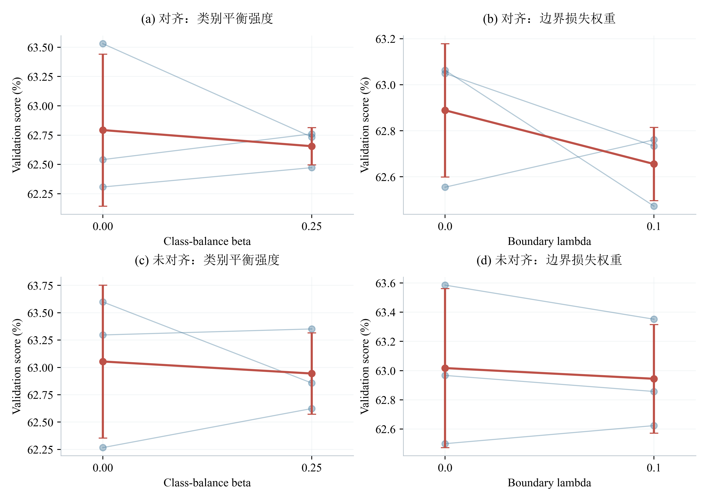
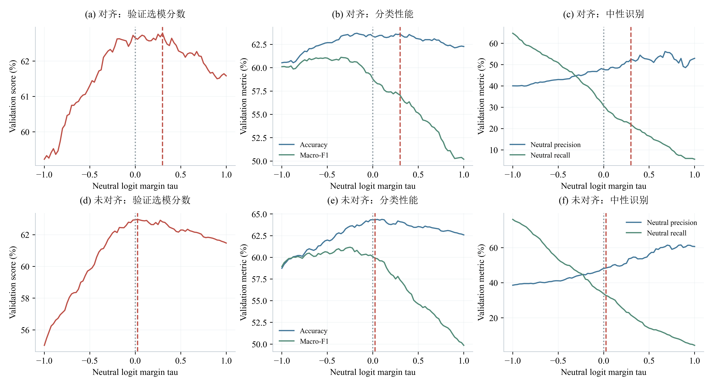

# 验证集选模、参数与决策边界分析

本补充报告只使用附件2验证集及训练过程保存的验证指标；本次未读取test、附件3、附件4，不修改正式模型。
使用既定的对齐2027/2028/2035、未对齐2026/2031/2033。这些种子此前参考过test被指定，因此本次虽仅分析valid，也不能把历史方案选择重新描述为完全未接触test的过程。

## 3. 参数端点敏感性

**图注：** β比较0与0.25（noBeta对B0），边界损失最大λ比较0与0.1（noB对B0）。细蓝线连接同seed结果，红色为均值±样本标准差。各端点来自独立训练并按相同验证规则选取的检查点；λ含训练初期渐增，标的是配置最大值。本图仅支持“关闭/当前值”的局部对照，连线不代表中间参数已实验，不能证明β=0.25或λ=0.1是全局最优。
对齐版完整三参数扫描见[超参数敏感性分析](超参数敏感性分析.md)。本图仅保留早期端点对照。

## 4. 阈值是否需要调整

现有正式代码直接argmax三类logits，没有概率阈值。为分析中性边界，本次引入仅用于诊断的偏置：`pred = argmax([logit_negative, logit_neutral − tau, logit_positive])`。tau=0严格恢复原规则；tau增大使中性判定更严格，tau减小使中性判定更宽松。它是logit间隔阈值，不是情感强度阈值或概率阈值。

**图注：** 固定六个B0检查点，仅对验证集完整与局部30%缺失视图推理；tau在[-1,1]按0.025步长扫描。左列按同一70/30规则计算三个指定seed的平均分数，另外两列展示完整验证集的Accuracy/Macro-F1及中性Precision/Recall。灰虚线为tau=0，红虚线为扫描范围内分数最高的候选阈值；并列时优先最接近0，再取较小值。每种布局共用一个候选tau，不为每个seed单独挑值。六个模型两种视图在tau=0的Accuracy均与保存验证结果一致。

| 布局 | 候选tau | 默认分数 | 候选分数 |
|---|---:|---:|---:|
| 对齐 | 0.300 | 0.6266 | 0.6279 |
| 未对齐 | 0.025 | 0.6294 | 0.6297 |

候选阈值尚未应用到正式预测，也未据此重新测试test或专项集。本验证集同时用于选轮次及阈值，因此图中的最优分数是校准集结果，不能当作独立泛化提升。若最优位于搜索边缘，只能称该扫描范围内的候选。

## 复现与范围

在CPMCM根目录执行：`conda run -n CPMCM python "problem2_retrain_v2 copy/验证集选模分析.py"`。阈值诊断调用cuda:3推理验证集，不训练。原始logits、参数端点数据、候选阈值和源文件哈希保存在validation_analysis/。本报告补齐已有证据与新增验证诊断，对齐版多取值参数扫描已单独完成。
