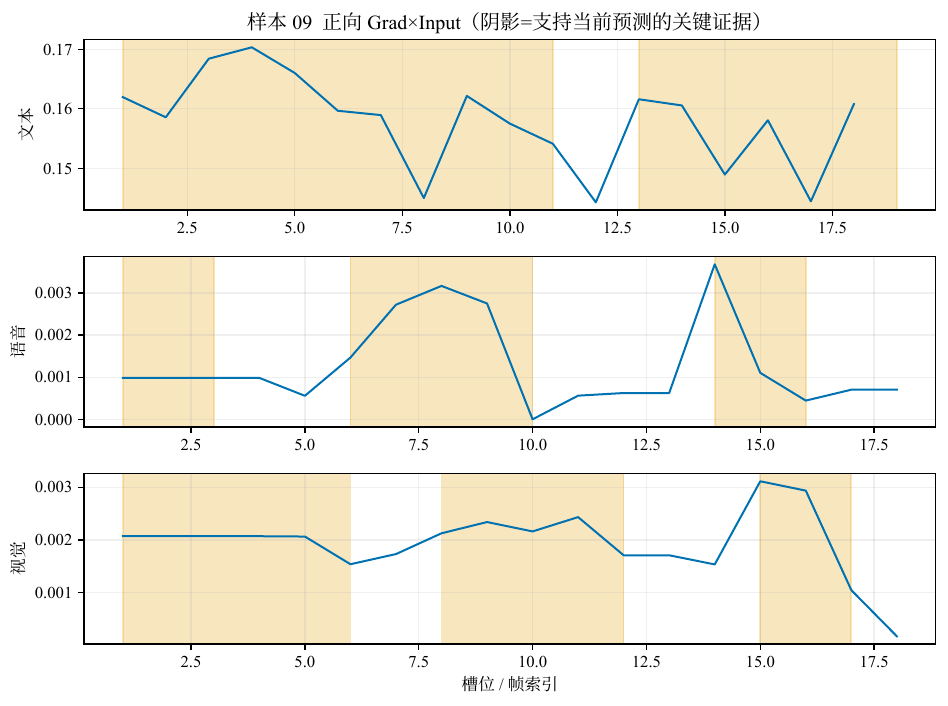
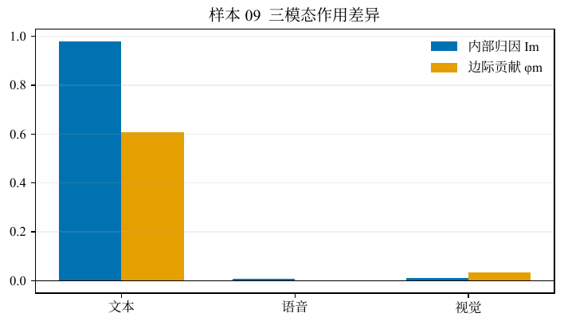
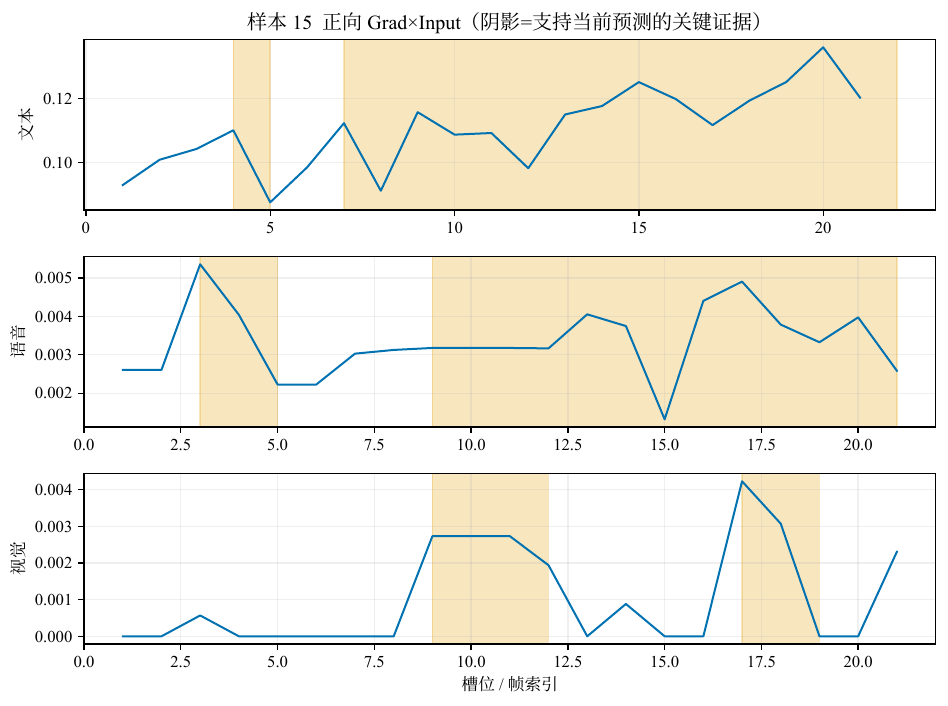
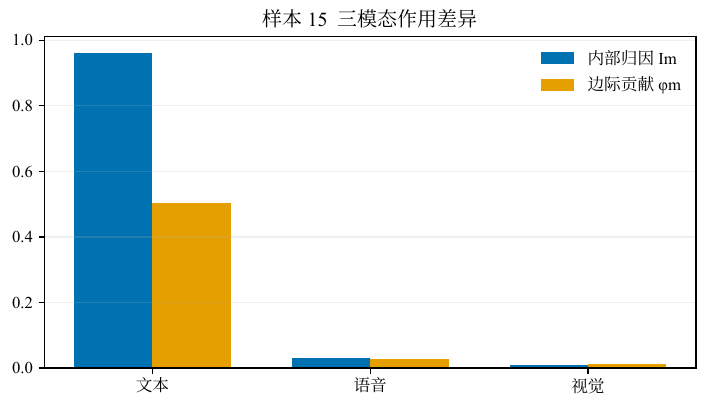
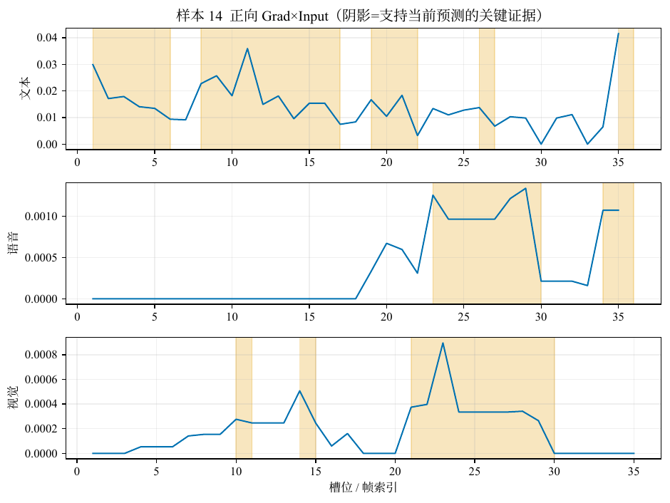
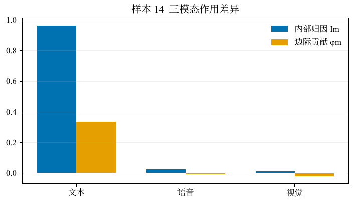

# 问题三 · 结果分析（对齐版）

## 0. 说明

问题三在对齐设定下不重新训练预测器，而是冻结问题二正式结构 F1 的一组重复实验检查点，取其中**测试准确率处于中位**的那一枚作为解释对象。解释层采用正向 Grad×Input、多上下文模态边际贡献、连续关键证据，以及 Comp、Suff、Stab 三类事后一致性指标；不改写网络参数，故预测与问题二冻结前向一致。下文聚焦附件4全量解释的模态与保真统计，并选取三条情形互异的样本读图。预测性能本身属问题二，本文不展开。

---

## 1. 附件4：模态作用与保真指标

附件4共 20 条，无公开金标签，因此只报告模型预测与可复核解释，不计算准确率。

**表1　附件4预测极性分布**

| 极性 | 正 | 负 | 中 | 合计 |
|------|----|----|----|------|
| 条数 | 9 | 8 | 3 | 20 |

与「专项样例覆盖三类」的设定相符。

**表2　模态内部归因与边际贡献（20 条均值）**

| 量 | 文本 | 语音 | 视觉 |
|----|------|------|------|
| 内部归因 \(I_m\) | **0.985** | 0.008 | 0.007 |
| 边际贡献 \(\tilde\phi_m\) | **0.473** | ≈0 | ≈0 |
| 主要参考模态计数 | **20** | 0 | 0 |

在对齐 F1 的冻结前向下，附件4样本的正向支持几乎由文本槽提供，音视更多以弱辅助甚至近乎旁路的方式进入融合。不能据此断言音视特征无信息，而应表述为：在当前模型与该批样例上，**抬高当前预测类的一阶质量主要落在文本轴**。

**表3　保真与稳定性（20 条）**

| 指标 | 均值 | 最小 | 最大 |
|------|------|------|------|
| Comp | **0.474** | 0.173 | 0.778 |
| Suff | 0.064 | 0.005 | 0.338 |
| Stab | **0.821** | 0.333 | 1.000 |

Comp 较高表明：删去关键证据窗后，当前类概率通常会明显下降；Suff 较低表明仅保留关键窗时仍可能偏离完整输入；Stab 较高说明窗位对音视小噪声总体稳定。合起来宜写成「文本主导、证据较必要、窗位较稳，但单靠关键窗未必充分复现完整前向」，而非简单因果归因。

**表4　逐条摘要（极性、\(I_T\)、\(\tilde\phi_T\)、Comp / Suff / Stab）**

| 编号 | 极性 | \(I_T\) | \(\tilde\phi_T\) | Comp | Suff | Stab |
|------|------|---------|------------------|------|------|------|
| 01 | 中 | 0.984 | 0.246 | 0.352 | 0.022 | 0.978 |
| 02 | 正 | 0.998 | 0.265 | 0.277 | 0.338 | 0.630 |
| 03 | 负 | 0.998 | 0.467 | 0.579 | 0.175 | 0.972 |
| 04 | 负 | 0.993 | 0.502 | 0.678 | 0.011 | 0.968 |
| 05 | 正 | 0.948 | 0.153 | 0.173 | 0.140 | 1.000 |
| 06 | 正 | 1.000 | 0.664 | 0.540 | 0.020 | 0.889 |
| 07 | 正 | 1.000 | 0.522 | 0.437 | 0.064 | 0.963 |
| 08 | 正 | 1.000 | 0.692 | 0.621 | 0.011 | **0.333** |
| 09 | 负 | 0.980 | 0.609 | 0.513 | 0.005 | 0.967 |
| 10 | 负 | 0.997 | 0.702 | **0.778** | 0.007 | 0.651 |
| 11 | 负 | 0.991 | 0.539 | 0.546 | 0.055 | 0.778 |
| 12 | 负 | 1.000 | 0.568 | 0.710 | 0.088 | 0.333 |
| 13 | 中 | 0.997 | 0.449 | 0.355 | 0.070 | 0.667 |
| 14 | 中 | 0.964 | 0.336 | 0.291 | 0.075 | 1.000 |
| 15 | 正 | 0.962 | 0.503 | 0.443 | 0.005 | 1.000 |
| 16 | 负 | 0.993 | 0.610 | 0.362 | 0.025 | 0.667 |
| 17 | 正 | 0.978 | 0.630 | 0.478 | 0.007 | 1.000 |
| 18 | 负 | 0.977 | 0.140 | 0.426 | 0.065 | 0.968 |
| 19 | 正 | 0.972 | 0.354 | 0.642 | 0.052 | 0.667 |
| 20 | 正 | 0.969 | 0.510 | 0.289 | 0.039 | 1.000 |

**结果说明。** 主参考全为文本：口播中已有明确评价性短语时，对齐 F1 倾向于把它作为抬高当前类的主要通道。Suff 普遍低于 Comp，关键窗不是「充分统计量」。Stab 多数较高，但样本 08、12 低至 0.333，汇总均值之外仍需抽查。

---

## 2. 典型样本读图

蓝线为槽级正向 Grad×Input \(r_{m,t}\)；若某模态对当前类几乎无正向贡献，则整段为 0（如部分样本的视觉轴）。读图示例优先选取**三模态蓝线均有起伏**的样本，避免「音视为一条死直线」不便展示。从 20 条中按负 / 正 / 中各取一条：

| 样本 | 情形 | 选型意图 |
|------|------|----------|
| 09 | 负类；三模态 \(r\) 均有峰；Comp 0.513，Stab 0.967 | 强负向文本 + 音视曲线可见 |
| 15 | 正类；音视峰值相对明显；Comp 0.443，Stab 1.000 | 正类且蓝线不空 |
| 14 | 中性；音视槽非零较多；Comp 0.291，Stab 1 | 弱可删边界，曲线仍有波动 |

### 2.1 样本 09：负类，三模态曲线均有起伏

预测为负，强度约 −2.40。主参考仍为文本（\(I_T\approx0.98\)），但语音、视觉正向质量非全零，importance 图上可见小峰与证据阴影。关键文本含 “did not like” / “would not recommend”。Comp 0.513，Stab 0.967。

*图1　样本09：位置级正向 Grad×Input*

*图2　样本09：\(I_m\) vs \(\tilde\phi_m\)*

### 2.2 样本 15：正类，音视蓝线有波动

预测为正，强度约 0.75。文本主导，但语音非零槽较多、视觉亦有峰。关键文本覆盖 education / transform lives 一带。Comp 0.443，Stab 1.000。

*图3　样本15：正向 Grad×Input*

*图4　样本15：模态对比*

### 2.3 样本 14：中性，弱可删但曲线不空

预测为中，强度 0。Comp 仅 **0.291**，Stab=1；音视 \(r\) 非零槽较多，故蓝线仍有起伏，只是删证据对中性概率冲击弱。解释卡宜写成「候选证据 + 人工复核」。

*图5　样本14：正向 Grad×Input*

*图6　样本14：模态对比*

### 2.4 对齐版典型样本解释卡

#### 表5　样本 09

| 项目 | 内容 |
|---|---|
| 样本编号 | 09 |
| 预测结果 | 负，强度 -2.40，该类概率 0.99 |
| 模态作用 | 内部归因 文本 0.98 / 语音 0.01 / 视觉 0.01；边际贡献 φ̃ 文本 0.609 / 语音 -0.002 / 视觉 0.034 |
| 主要参考模态 | 文本 |
| 关键文本 | “( uh ##h ) i did not like this movie”（槽 1:11，约 0.5–2.2 s）；“, i would not recommend it”（槽 13:19，约 2.8–4.9 s） |
| 关键语音 | 槽 1:3，约 0.5–0.9 s（槽对齐近似）；槽 6:10，约 1.2–1.8 s（槽对齐近似）；槽 14:16，约 2.8–3.0 s（槽对齐近似） |
| 关键画面 | 槽 1:6，约 0.5–1.2 s（槽对齐近似）；槽 8:12，约 1.5–2.4 s（槽对齐近似）；槽 15:17，约 2.9–3.2 s（槽对齐近似） |
| Comp / Suff / Stab | Comp 0.513；Suff 0.005；Stab 0.967 |
| 人工核查 | （待人工对照原视频填写） |

#### 表6　样本 15

| 项目 | 内容 |
|---|---|
| 样本编号 | 15 |
| 预测结果 | 正，强度 0.75，该类概率 0.95 |
| 模态作用 | 内部归因 文本 0.96 / 语音 0.03 / 视觉 0.01；边际贡献 φ̃ 文本 0.503 / 语音 0.027 / 视觉 0.013 |
| 主要参考模态 | 文本 |
| 关键文本 | “their”（槽 4:5，约 1.1–1.3 s）；“the family prior ##iti ##ze education because they believed in its power to transform lives”（槽 7:22，约 1.9–7.2 s） |
| 关键语音 | 槽 3:5，约 0.6–1.3 s（槽对齐近似）；槽 9:21，约 2.5–6.8 s（槽对齐近似） |
| 关键画面 | 槽 9:12，约 2.5–3.0 s（槽对齐近似）；槽 17:19，约 5.3–6.2 s（槽对齐近似） |
| Comp / Suff / Stab | Comp 0.443；Suff 0.005；Stab 1.000 |
| 人工核查 | （待人工对照原视频填写） |

#### 表7　样本 14

| 项目 | 内容 |
|---|---|
| 样本编号 | 14 |
| 预测结果 | 中，强度 0.00，该类概率 0.58 |
| 模态作用 | 内部归因 文本 0.96 / 语音 0.02 / 视觉 0.01；边际贡献 φ̃ 文本 0.336 / 语音 -0.009 / 视觉 -0.021 |
| 主要参考模态 | 文本 |
| 关键文本 | “he is the co -”（槽 1:6，约 0.5–1.0 s）；“ross ##en and vet ##tes ##e limited and the”（槽 8:17，约 1.5–3.4 s）；“director of uniform”（槽 19:22，约 4.2–5.5 s） |
| 关键语音 | 槽 23:30，约 5.9–7.4 s（槽对齐近似）；槽 34:36，约 8.8–9.7 s（槽对齐近似） |
| 关键画面 | 槽 10:11，约 2.0–2.1 s（槽对齐近似）；槽 14:15，约 2.5–2.9 s（槽对齐近似）；槽 21:30，约 4.9–7.4 s（槽对齐近似） |
| Comp / Suff / Stab | Comp 0.291；Suff 0.075；Stab 1.000 |
| 人工核查 | （待人工对照原视频填写） |

**三条卡片合读。** 样本 09 / 15 / 14 覆盖负、正、中，且 importance 图上音视蓝线均非全程死零，便于展示方法；主参考仍为文本。人工核查栏建议对照原视频核对关键文本与音视近似时段。

---

## 3. 与未对齐设定的对照

同协议未对齐结果见未对齐版结果分析。附件4上：对齐版 \(I_T\) 约 0.985、主参考全文本、Comp 均值约 0.47；未对齐版 \(I_T\) 约 0.73，音视升至约 0.16 / 0.11，并出现视觉主参考，但 Comp 均值约 0.24。宜区分「归因质量占比」与「删除后概率是否下降」。

---

## 4. 小结

对齐版问题三以 F1 **中位准确率检查点**为黑盒，在附件4上给出文本主导的正向解释，并用 Comp/Suff/Stab 约束措辞。典型读图选用 09 / 15 / 14，使三模态蓝线均有起伏，避免音视全程为 0 的展示样本。全量图表见结果目录。

相关：[模型建立_对齐版.md](模型建立_对齐版.md) · [数据预处理说明.md](数据预处理说明.md) · [问题三结果分析_未对齐版.md](../problem3_unaligned/问题三结果分析_未对齐版.md)

## 5. 测试集上的基础性能评价、可视化分析与错误归因结论

> 本节给出附件2 **测试集**（`test`，727 条，有金标签）上的基础性能、可视化与错误归因。  
> **不是**附件4（附件4无公开金标，只做预测与解释汇总）。  
> 检查点：`AAAmodel/checkpoints/selected/problem3/aligned_gate_B0_primary.pt`（sha256 前 12 位 `106d3ad1a139`）。解释层零训练，不改变冻结前向预测。  
> 图题写在正文；`figures/test_*.pdf` 图内不另加标题。

### 5.1 基础性能评价

路径：`/user_home/gaojianan/CPMCM/AAAdata/Appendix_2/标准化/对齐版本_retrain_20260925/processed_po/test.npz`。

| 指标 | 数值 |
|------|------|
| Accuracy | **69.74%** |
| Macro-F1 | 64.32% |
| MAE | 0.6183 |
| Pearson | 0.6961 |
| 中性 Precision / Recall | 50.9% / 37.3% |
| 错误条数 | 220 / 727 |

按真实类错误率：负 28.0%、中 **62.7%**、正 17.4%。中性类错误率最高。

（对照：同检查点验证集 ACC=63.46%，错误 266/728；选 epoch 仅用验证集。）

### 5.2 可视化分析

- 图　测试集混淆矩阵：`figures/test_confusion.pdf`（行=真实，列=预测；类别序负/中/正）
- 图　测试集按真实类错误率：`figures/test_error_by_class.pdf`

混淆计数：

|  | 预负 | 预中 | 预正 |
|--|-----:|-----:|-----:|
| 真负 | 149 | 22 | 36 |
| 真中 | 32 | 59 | 67 |
| 真正 | 28 | 35 | 299 |

### 5.3 错误归因结论

从测试集错误样本中按「中→正 / 中→负 / 负→正 / 正→负 …」优先抽取高置信错例，并在**同一冻结模型**上跑 Grad×Input 解释（不改预测）。

| 样本 | 真→预 | 预置信度 | 主参考 | $I_T/I_A/I_V$ | Comp/Suff/Stab | 文本关键窗词面（节选） |
|------|-------|----------|--------|-----------------|----------------|------------------------|
| F_YaG_pvZrA$_$11 | 中→正 | 0.99 | 文本 | 0.99/0.01/0.00 | 0.608 / 0.001 / 0.667 | so not only make your resume immaculate but also |
| 267466$_$38 | 中→负 | 0.97 | 文本 | 1.00/0.00/0.00 | 0.479 / 0.039 / 1.000 | umm ) if it up i mean , then it ' s just differe |
| cml9rShionM$_$3 | 负→正 | 0.98 | 文本 | 0.99/0.01/0.00 | 0.485 / 0.013 / 0.667 | we are very warm - hearted people , we put a lot |
| c5zxqITn3ZM$_$5 | 正→负 | 0.93 | 文本 | 1.00/0.00/0.00 | 0.322 / 0.089 / 0.956 | and it ’ s , it ’ s very much emotional at times |
| 88791$_$1 | 负→中 | 0.81 | 文本 | 1.00/0.00/0.00 | 0.499 / 0.014 / 0.333 | this is the movie |
| 226601$_$0 | 正→中 | 0.81 | 文本 | 1.00/0.00/0.00 | 0.628 / 0.011 / 0.333 | i ' m reviewing the movie the missing starring t |

**结论**

1. **错因主体在分类边界，不在解释层**：问题三不更新参数，测试集预测与问题二冻结前向一致；解释只说明「为何得到当前预测」，不能把错例改对。  
2. **中性最易错**：真实中性错误率最高；错例主参考仍常落在文本，属弱极性/中性边界判偏。  
3. **解释与错误同向**：高置信错例的 Comp 往往仍为正，关键窗非空——证据支持的是**错误类别**。  
4. 与附件4区分：附件4用于交付全量预测与解释卡；本节用附件2测试集金标做对错评价与归因。

## 6. 验证集上的基础性能评价、可视化分析与错误归因结论

> 本节给出附件2 **验证集**（`valid`，728 条，有金标签）上的基础性能、可视化与错误归因。  
> 与「测试集结果分析」并列；**选 epoch 使用本划分**，测试集滑动/终评不参与选模。  
> **不是**附件4。检查点：`AAAmodel/checkpoints/selected/problem3/aligned_gate_B0_primary.pt`（sha256 前 12 位 `106d3ad1a139`）。图内无标题，图名见下文。

### 1 基础性能评价

路径：`/user_home/gaojianan/CPMCM/AAAdata/Appendix_2/标准化/对齐版本_retrain_20260925/processed_po/valid.npz`。

| 指标 | 数值 |
|------|------|
| Accuracy | **63.46%** |
| Macro-F1 | 59.93% |
| MAE | 0.5977 |
| Pearson | 0.6561 |
| 中性 Precision / Recall | 46.5% / 35.9% |
| 错误条数 | 266 / 728 |

按真实类错误率：负 33.5%、中 **64.1%**、正 23.4%。中性类错误率最高。

### 2 可视化分析

- 图　验证集混淆矩阵：`figures/valid_confusion.pdf`（行=真实，列=预测；负/中/正）
- 图　验证集按真实类错误率：`figures/valid_error_by_class.pdf`

|  | 预负 | 预中 | 预正 |
|--|-----:|-----:|-----:|
| 真负 | 137 | 30 | 39 |
| 真中 | 26 | 66 | 92 |
| 真正 | 33 | 46 | 259 |

### 3 错误归因结论

从验证集错误样本中按「中→正 / 中→负 / 负→正 / 正→负 …」抽取高置信错例，冻结模型上做 Grad×Input（不改预测）。

| 样本 | 真→预 | 预置信度 | 主参考 | $I_T/I_A/I_V$ | Comp/Suff/Stab | 文本关键窗词面（节选） |
|------|-------|----------|--------|-----------------|----------------|------------------------|
| x2lOwQaAn4g$_$4 | 中→正 | 0.98 | 文本 | 0.98/0.00/0.02 | 0.532 / 0.001 / 0.952 | all of these exercises are jean friendly and gua |
| 237009$_$9 | 中→负 | 0.99 | 文本 | 1.00/0.00/0.00 | 0.574 / 0.110 / 0.333 | umm ) it ' s ( uh ##h ) not |
| 7r4vRxKLFCA$_$6 | 负→正 | 0.96 | 文本 | 0.99/0.00/0.01 | 0.239 / 0.109 / 1.000 | they go back they come back |
| 32681$_$5 | 正→负 | 0.97 | 文本 | 0.99/0.00/0.01 | 0.510 / 0.025 / 0.986 | ( umm ) the only time i was at the the ( stu ##t |
| 225770$_$5 | 负→中 | 0.72 | 文本 | 1.00/0.00/0.00 | 0.518 / 0.024 / 0.667 | starts at his trial |
| EQxkXiWAm08$_$8 | 正→中 | 0.88 | 文本 | 1.00/0.00/0.00 | 0.648 / 0.159 / 0.667 | a real estate attorney needs writing the contrac |

**结论**

1. 解释层零训练，验证集预测与问题二冻结前向一致；错因在分类边界，不在解释层。  
2. 中性最易错；错例主参考多为文本，属弱极性/中性边界判偏。  
3. 高置信错例 Comp 仍常为正——证据支持的是错误类别。  
4. 附件4无金标，不对附件4报准确率。
