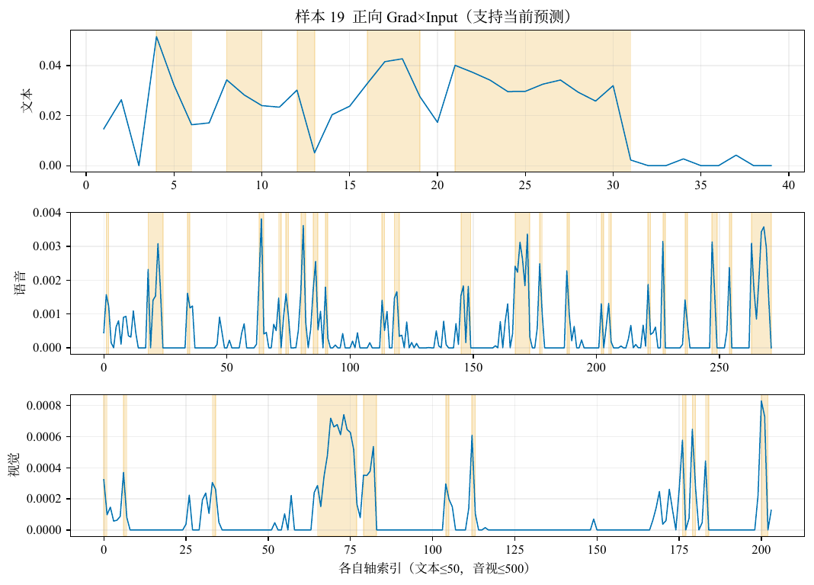
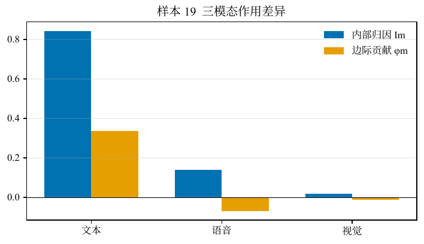
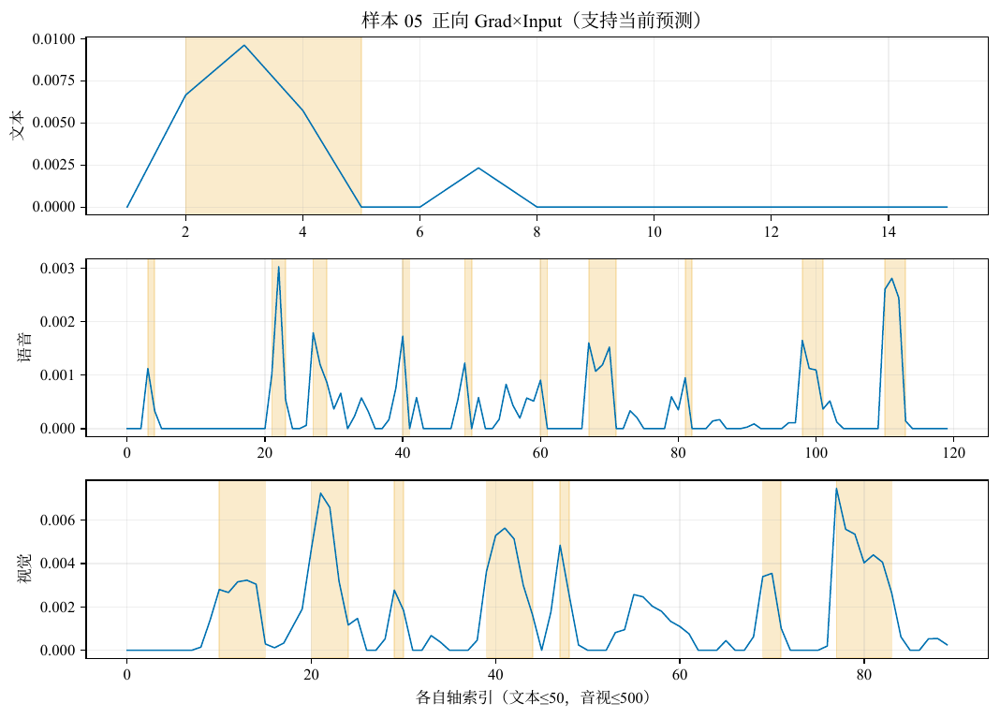
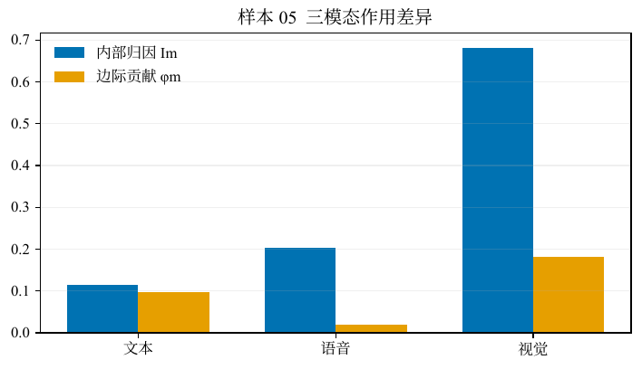
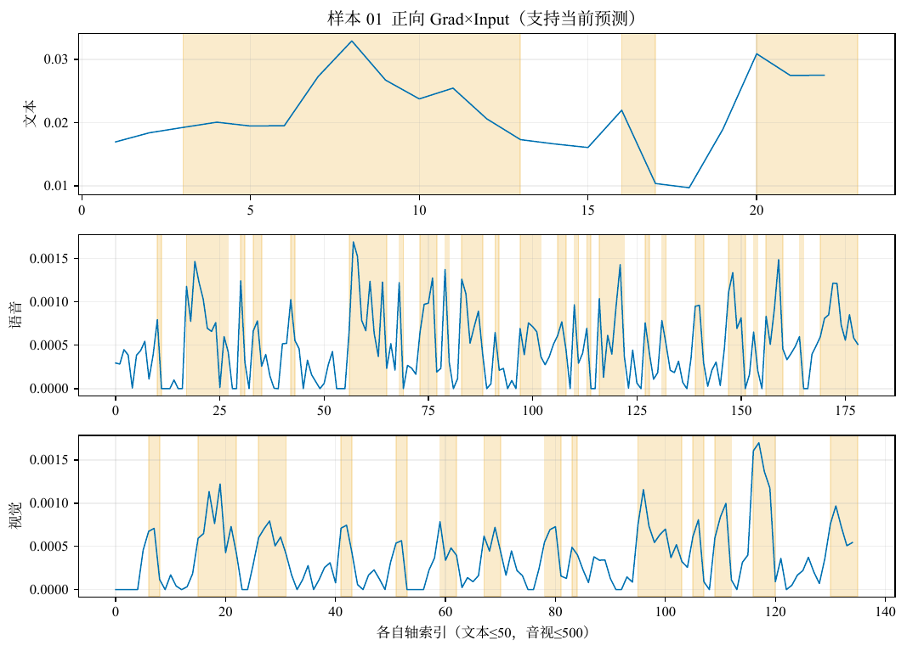
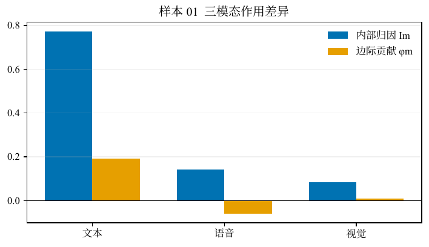

# 问题三 · 结果分析（未对齐版）

## 0. 说明

问题三在未对齐设定下不重新训练预测器，而是冻结问题二 SoftAlignment 检查点，取 **seed=2026** 那一枚作为解释对象，解释层采用正向 Grad×Input、多上下文模态边际贡献、连续关键证据，以及 Comp、Suff、Stab；并辅以 soft association 将音视证据窗挂回文本词元时间。不改写网络参数，故预测与问题二冻结前向一致。下文聚焦附件4全量解释，并选取三条蓝线均有起伏、情形互异的样本读图。预测性能本身属问题二，本文不展开。

---

## 1. 附件4：模态作用与保真指标

附件4共 20 条，无公开金标签，因此只报告模型预测与可复核解释，不计算准确率。

**表1　附件4预测极性分布**

| 极性 | 正 | 负 | 中 | 合计 |
| ---- | -- | -- | -- | ---- |
| 条数 | 9  | 8  | 3  | 20   |

**表2　模态内部归因与边际贡献（20 条均值）**

| 量                       | 文本            | 语音  | 视觉        |
| ------------------------ | --------------- | ----- | ----------- |
| 内部归因\(I_m\)          | **0.728** | 0.161 | 0.111       |
| 边际贡献\(\tilde\phi_m\) | **0.273** | ≈0   | 0.033       |
| 主要参考模态计数         | **17**    | 0     | **3** |

相对对齐版「文本垄断」，未对齐版把约三成正向质量分给音视，并出现 3 条视觉主参考（样本 05、13、14）。这应表述为：分轴 soft alignment 让音视进入了抬高当前类的一阶通道；不能写成「中性难题已被音视解决」。

**表3　保真与稳定性（20 条）**

| 指标 | 均值            | 最小  | 最大  |
| ---- | --------------- | ----- | ----- |
| Comp | **0.241** | 0.046 | 0.546 |
| Suff | 0.063           | 0.001 | 0.236 |
| Stab | **0.902** | 0.637 | 1.000 |

Comp 均值约 0.24（对齐约 0.47），说明未对齐证据窗对当前类概率的可删冲击整体更弱；Stab 仍高。写结论时必须区分「归因质量占比上升」与「删除后概率是否真降」。

**表4　逐条摘要（极性、\(I_T\)、\(\tilde\phi_T\)、Comp / Suff / Stab、主参考）**

| 编号 | 极性 | \(I_T\) | \(\tilde\phi_T\) | Comp            | Suff  | Stab  | 主参考         |
| ---- | ---- | ------- | ---------------- | --------------- | ----- | ----- | -------------- |
| 01   | 中   | 0.773   | 0.192            | 0.149           | 0.052 | 0.998 | 文本           |
| 02   | 中   | 0.671   | 0.092            | 0.064           | 0.040 | 0.985 | 文本           |
| 03   | 负   | 0.866   | 0.467            | **0.546** | 0.043 | 0.992 | 文本           |
| 04   | 负   | 0.901   | 0.336            | 0.309           | 0.138 | 0.947 | 文本           |
| 05   | 正   | 0.115   | 0.098            | 0.175           | 0.021 | 1.000 | **视觉** |
| 06   | 正   | 0.963   | 0.361            | 0.127           | 0.089 | 0.991 | 文本           |
| 07   | 正   | 0.820   | 0.273            | 0.172           | 0.065 | 0.986 | 文本           |
| 08   | 正   | 0.849   | 0.355            | 0.276           | 0.035 | 0.978 | 文本           |
| 09   | 负   | 0.774   | 0.470            | 0.361           | 0.041 | 0.667 | 文本           |
| 10   | 负   | 0.868   | 0.502            | 0.329           | 0.236 | 0.973 | 文本           |
| 11   | 负   | 0.882   | 0.344            | 0.345           | 0.030 | 0.637 | 文本           |
| 12   | 负   | 0.915   | 0.316            | 0.299           | 0.008 | 0.658 | 文本           |
| 13   | 正   | 0.444   | −0.005          | 0.061           | 0.058 | 0.654 | **视觉** |
| 14   | 正   | 0.202   | −0.028          | 0.046           | 0.080 | 0.979 | **视觉** |
| 15   | 正   | 0.584   | 0.179            | 0.122           | 0.019 | 1.000 | 文本           |
| 16   | 负   | 0.881   | 0.414            | 0.213           | 0.031 | 0.667 | 文本           |
| 17   | 正   | 0.927   | 0.386            | 0.371           | 0.001 | 0.981 | 文本           |
| 18   | 中   | 0.741   | 0.157            | 0.192           | 0.006 | 0.977 | 文本           |
| 19   | 负   | 0.843   | 0.337            | 0.412           | 0.211 | 0.983 | 文本           |
| 20   | 正   | 0.548   | 0.223            | 0.247           | 0.058 | 0.980 | 文本           |

**结果说明。** seed=2026 SoftAlignment 在附件4上解释更分散、Comp 偏低；Stab 多数接近 1，窗位不稳不是主矛盾。论文表述宜写成：未对齐解释更丰富，但保真度（尤其 Comp）需更克制的措辞。

---

## 2. 典型样本读图

蓝线为槽级正向 Grad×Input \(r_{m,t}\)；部分样本视觉轴可全程为 0。读图优先选取**三模态蓝线均有起伏**者。从 20 条中按负 / 正 / 中各取一条：

| 样本 | 情形                                         | 选型意图                   |
| ---- | -------------------------------------------- | -------------------------- |
| 19   | 负类，文本主导；Comp 0.412，音视\(r\) 均有峰 | 未对齐侧「仍可删」的负例   |
| 05   | 正类，视觉主参考（\(I_V\approx0.68\)）       | 对齐版几乎见不到的音视主导 |
| 01   | 中性；音视非零槽很多；Comp 0.149             | 弱可删边界，曲线仍有波动   |

### 2.1 样本 19：负类、文本主导、曲线有起伏

预测为负，强度约 −0.56。\(I_T\approx0.84\)，音频约 0.14；关键文本含 “forgiving” / “mistakes”。Comp **0.412**，Stab 0.983。音视蓝线均有峰，便于展示未对齐长轴归因。

*图1　样本19：各轴正向 Grad×Input*

*图2　样本19：\(I_m\) vs \(\tilde\phi_m\)*

### 2.2 样本 05：正类、视觉主参考

预测为正，强度约 0.98。主参考为视觉，\(I_V\approx0.68\)，\(\tilde\phi_V\approx0.18\)。Comp 仅约 0.175，Stab 为 1。音视可主导归因份额，但对概率的可删冲击仍弱；措辞应偏「内部敏感度」而非强因果。画面时段由 soft association 挂到口播词元（如 “Hi” / “name”）。

*图3　样本05：正向 Grad×Input*

*图4　样本05：模态对比*

### 2.3 样本 01：中性、弱可删但蓝线不空

预测为中，强度 0。主参考文本，音视 \(I_A/I_V\) 约 0.14 / 0.08。Comp **0.149**，Stab 0.998。曲线有峰但删证据对中性概率冲击弱，解释卡宜写成「候选证据 + 人工复核」。

*图5　样本01：正向 Grad×Input*

*图6　样本01：模态对比*

### 2.4 未对齐版典型样本解释卡

时间锚定：关键**文本**用词元自身 MFA 时间戳；关键**语音 / 画面**按证据窗逐段 soft association——一词用该词时段，多词取首尾词元 MFA 拼接。

#### 表5　样本 19

| 项目               | 内容                                                                                                                       |
| ------------------ | -------------------------------------------------------------------------------------------------------------------------- |
| 样本编号           | 19                                                                                                                         |
| 预测结果           | 负，强度 -0.56，该类概率 0.46                                                                                              |
| 模态作用           | 内部归因 文本 0.84 / 语音 0.14 / 视觉 0.02；边际贡献 φ̃ 文本 0.337 / 语音 -0.069 / 视觉 -0.011                           |
| 主要参考模态       | 文本                                                                                                                       |
| 关键文本           | “for ##giving”（槽 4:6，约 1.7–2.3 s）；“they own”（槽 8:10，约 3.0–3.5 s）；“mistakes”（槽 12:13，约 3.9–4.6 s） |
| 关键语音           | 槽 1:2，对应“People”，约 0.5–0.8 s；槽 18:24，对应“People”，约 0.5–0.8 s；槽 34:35，对应“People”，约 0.5–0.8 s    |
| 关键画面           | 槽 0:1，对应“People”，约 0.5–0.8 s；槽 6:7，对应“People”，约 0.5–0.8 s；槽 33:34，对应“brands”，约 2.3–2.8 s      |
| Comp / Suff / Stab | Comp 0.412；Suff 0.211；Stab 0.983                                                                                         |
| 人工核查           | （待人工对照原视频填写）                                                                                                   |

#### 表6　样本 05

| 项目               | 内容                                                                                                            |
| ------------------ | --------------------------------------------------------------------------------------------------------------- |
| 样本编号           | 05                                                                                                              |
| 预测结果           | 正，强度 0.98，该类概率 0.77                                                                                    |
| 模态作用           | 内部归因 文本 0.12 / 语音 0.20 / 视觉 0.68；边际贡献 φ̃ 文本 0.098 / 语音 0.020 / 视觉 0.182                  |
| 主要参考模态       | 视觉                                                                                                            |
| 关键文本           | “, my name”（槽 2:5，约 1.9–2.3 s）                                                                          |
| 关键语音           | 槽 3:4，对应“Hi”，约 1.2–1.6 s；槽 21:23，对应“name”，约 2.1–2.3 s；槽 27:29，对应“name”，约 2.1–2.3 s |
| 关键画面           | 槽 10:15，对应“Hi”，约 1.2–1.6 s；槽 20:24，对应“name”，约 2.1–2.3 s；槽 29:30，对应“is”，约 2.3–2.4 s |
| Comp / Suff / Stab | Comp 0.175；Suff 0.021；Stab 1.000                                                                              |
| 人工核查           | （待人工对照原视频填写）                                                                                        |

#### 表7　样本 01

| 项目               | 内容                                                                                                                                                                                      |
| ------------------ | ----------------------------------------------------------------------------------------------------------------------------------------------------------------------------------------- |
| 样本编号           | 01                                                                                                                                                                                        |
| 预测结果           | 中，强度 0.00，该类概率 0.46                                                                                                                                                              |
| 模态作用           | 内部归因 文本 0.77 / 语音 0.14 / 视觉 0.08；边际贡献 φ̃ 文本 0.192 / 语音 -0.059 / 视觉 0.009                                                                                           |
| 主要参考模态       | 文本                                                                                                                                                                                      |
| 关键文本           | “wear components when replacing the timing belt is essential to”（槽 3:13，约 1.2–4.6 s）；“belt”（槽 16:17，约 5.4–5.8 s）；“mile ##age requirements”（槽 20:23，约 7.2–8.4 s） |
| 关键语音           | 槽 10:11，对应“Replacing”，约 0.5–1.0 s；槽 17:27，对应“Replacing these”，约 0.5–1.2 s；槽 30:31，对应“components”，约 1.4–2.0 s                                                 |
| 关键画面           | 槽 6:8，对应“Replacing”，约 0.5–1.0 s；槽 15:22，对应“Replacing these”，约 0.5–1.2 s；槽 26:31，对应“components”，约 1.4–2.0 s                                                   |
| Comp / Suff / Stab | Comp 0.149；Suff 0.052；Stab 0.998                                                                                                                                                        |
| 人工核查           | （待人工对照原视频填写）                                                                                                                                                                  |

**三条卡片合读。** 样本 19 / 05 / 01 覆盖负、正、中，且 importance 图上音视蓝线均非全程死零；样本 05 保留未对齐特有的视觉主参考。合读主线：精度可对齐、解释更分散、保真更需克制。

---

## 3. 与对齐设定的对照

同协议对齐结果见对齐版结果分析。附件4上：对齐版 \(I_T\) 约 0.985、主参考全文本、Comp 均值约 0.47；未对齐版（seed=2026）\(I_T\) 约 0.73，音视升至约 0.16 / 0.11，并出现视觉主参考，但 Comp 均值约 0.24。宜区分「归因质量占比」与「删除后概率是否下降」。

---

## 4. 小结

未对齐版以 SoftAlignment **seed=2026** 为黑盒，在附件4上给出更分散的正向解释，并用 Comp/Suff/Stab 约束措辞。典型读图选用 19 / 05 / 01，使三模态蓝线均有起伏，并保留视觉主参考例。全量图表见结果目录。

相关：[模型建立_未对齐版.md](模型建立_未对齐版.md) · [问题三结果分析_对齐版.md](../problem3/问题三结果分析_对齐版.md)

## 5. 测试集上的基础性能评价、可视化分析与错误归因结论

> 本节给出附件2 **测试集**（`test`，727 条，有金标签）上的基础性能、可视化与错误归因。  
> **不是**附件4（附件4无公开金标，只做预测与解释汇总）。  
> 检查点：`AAAmodel/checkpoints/selected/problem3/unaligned_gate_B0_primary.pt`（sha256 前 12 位 `f2feaa0d31ec`）。解释层零训练，不改变冻结前向预测。  
> 图题写在正文；`figures/test_*.pdf` 图内不另加标题。

### 5.1 基础性能评价

路径：`/user_home/gaojianan/CPMCM/AAAdata/Appendix_2/标准化/未对齐版本/processed_po/test.npz`。

| 指标 | 数值 |
|------|------|
| Accuracy | **70.29%** |
| Macro-F1 | 63.48% |
| MAE | 0.6472 |
| Pearson | 0.6749 |
| 中性 Precision / Recall | 54.3% / 31.6% |
| 错误条数 | 216 / 727 |

按真实类错误率：负 31.4%、中 **68.4%**、正 11.9%。中性类错误率最高。

（对照：同检查点验证集 ACC=64.29%，错误 260/728；选 epoch 仅用验证集。）

### 5.2 可视化分析

- 图　测试集混淆矩阵：`figures/test_confusion.pdf`（行=真实，列=预测；类别序负/中/正）
- 图　测试集按真实类错误率：`figures/test_error_by_class.pdf`

混淆计数：

|  | 预负 | 预中 | 预正 |
|--|-----:|-----:|-----:|
| 真负 | 142 | 21 | 44 |
| 真中 | 28 | 50 | 80 |
| 真正 | 22 | 21 | 319 |

### 5.3 错误归因结论

从测试集错误样本中按「中→正 / 中→负 / 负→正 / 正→负 …」优先抽取高置信错例，并在**同一冻结模型**上跑 Grad×Input 解释（不改预测）。

| 样本 | 真→预 | 预置信度 | 主参考 | $I_T/I_A/I_V$ | Comp/Suff/Stab | 文本关键窗词面（节选） |
|------|-------|----------|--------|-----------------|----------------|------------------------|
| nZFPKP9kBkw$_$4 | 中→正 | 0.97 | 文本 | 0.99/0.01/0.00 | 0.487 / 0.071 / 1.000 | s certainly many things from our heritage that c |
| 267466$_$38 | 中→负 | 0.90 | 文本 | 0.97/0.02/0.02 | 0.600 / 0.028 / 0.974 | ( umm ) if ve broken it up i mean , then it ' s  |
| cml9rShionM$_$3 | 负→正 | 0.96 | 文本 | 0.99/0.01/0.00 | 0.550 / 0.139 / 1.000 | we are very warm - , we put a lot of |
| 245582$_$16 | 正→负 | 0.87 | 文本 | 0.98/0.01/0.01 | 0.580 / 0.097 / 0.977 | but it ' s not as bad as i thought it |
| 88791$_$1 | 负→中 | 0.71 | 文本 | 0.93/0.02/0.06 | 0.326 / 0.012 / 1.000 | this is the movie |
| SYQ_zv8dWng$_$6 | 正→中 | 0.65 | 文本 | 0.90/0.02/0.08 | 0.285 / 0.098 / 1.000 | so we use that to purchase the income - investme |

**结论**

1. **错因主体在分类边界，不在解释层**：问题三不更新参数，测试集预测与问题二冻结前向一致；解释只说明「为何得到当前预测」，不能把错例改对。  
2. **中性最易错**：真实中性错误率最高；错例主参考仍常落在文本，属弱极性/中性边界判偏。  
3. **解释与错误同向**：高置信错例的 Comp 往往仍为正，关键窗非空——证据支持的是**错误类别**。  
4. 与附件4区分：附件4用于交付全量预测与解释卡；本节用附件2测试集金标做对错评价与归因。

## 6. 验证集上的基础性能评价、可视化分析与错误归因结论

> 本节给出附件2 **验证集**（`valid`，728 条，有金标签）上的基础性能、可视化与错误归因。  
> 与「测试集结果分析」并列；**选 epoch 使用本划分**，测试集滑动/终评不参与选模。  
> **不是**附件4。检查点：`AAAmodel/checkpoints/selected/problem3/unaligned_gate_B0_primary.pt`（sha256 前 12 位 `f2feaa0d31ec`）。图内无标题，图名见下文。

### 1 基础性能评价

路径：`/user_home/gaojianan/CPMCM/AAAdata/Appendix_2/标准化/未对齐版本/processed_po/valid.npz`。

| 指标 | 数值 |
|------|------|
| Accuracy | **64.29%** |
| Macro-F1 | 59.63% |
| MAE | 0.6026 |
| Pearson | 0.6533 |
| 中性 Precision / Recall | 48.4% / 32.6% |
| 错误条数 | 260 / 728 |

按真实类错误率：负 37.4%、中 **67.4%**、正 17.5%。中性类错误率最高。

### 2 可视化分析

- 图　验证集混淆矩阵：`figures/valid_confusion.pdf`（行=真实，列=预测；负/中/正）
- 图　验证集按真实类错误率：`figures/valid_error_by_class.pdf`

|  | 预负 | 预中 | 预正 |
|--|-----:|-----:|-----:|
| 真负 | 129 | 33 | 44 |
| 真中 | 25 | 60 | 99 |
| 真正 | 28 | 31 | 279 |

### 3 错误归因结论

从验证集错误样本中按「中→正 / 中→负 / 负→正 / 正→负 …」抽取高置信错例，冻结模型上做 Grad×Input（不改预测）。

| 样本 | 真→预 | 预置信度 | 主参考 | $I_T/I_A/I_V$ | Comp/Suff/Stab | 文本关键窗词面（节选） |
|------|-------|----------|--------|-----------------|----------------|------------------------|
| x2lOwQaAn4g$_$4 | 中→正 | 0.95 | 文本 | 0.99/0.01/0.00 | 0.334 / 0.057 / 0.975 | all of these exercises are jean friendly and gua |
| 236021$_$3 | 中→负 | 0.91 | 文本 | 0.99/0.01/0.00 | 0.673 / 0.067 / 0.968 | thinks the whole situation is silly |
| zjYEBwXGD8I$_$13 | 负→正 | 0.86 | 文本 | 0.98/0.01/0.00 | 0.430 / 0.076 / 1.000 | so we ' ve actually done quite a few phone calls |
| f_ZJ7L14oYQ$_$21 | 正→负 | 0.93 | 文本 | 0.97/0.01/0.01 | 0.718 / 0.037 / 0.971 | just so much more convenient than stupid boots t |
| 266791$_$29 | 负→中 | 0.67 | 文本 | 0.95/0.02/0.04 | 0.323 / 0.037 / 1.000 | obviously c ##g |
| RArhIHk4Qs4$_$19 | 正→中 | 0.69 | 文本 | 0.86/0.03/0.12 | 0.317 / 0.017 / 0.978 | so the answer depends the actual behavior is |

**结论**

1. 解释层零训练，验证集预测与问题二冻结前向一致；错因在分类边界，不在解释层。  
2. 中性最易错；错例主参考多为文本，属弱极性/中性边界判偏。  
3. 高置信错例 Comp 仍常为正——证据支持的是错误类别。  
4. 附件4无金标，不对附件4报准确率。
