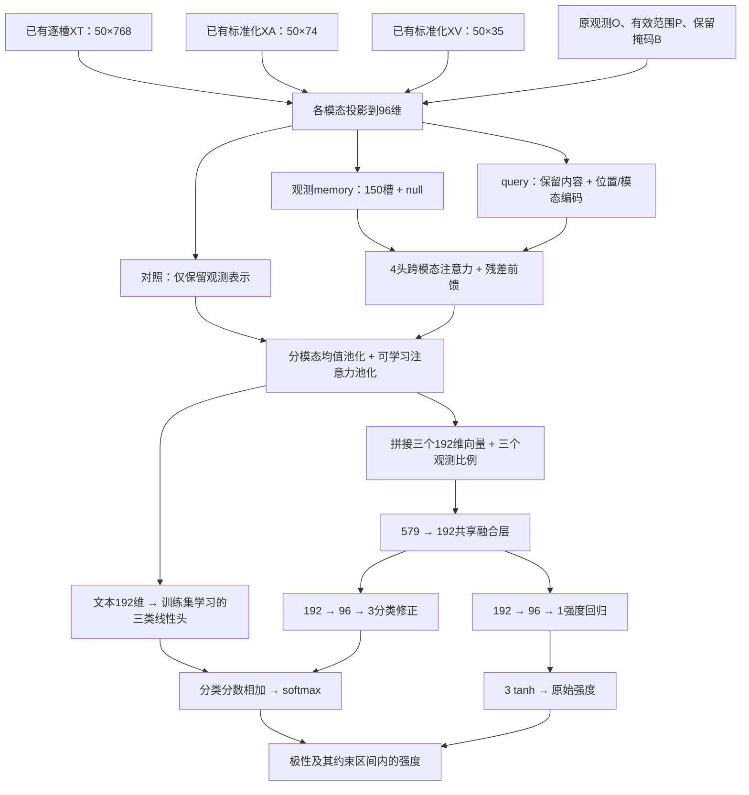

# 问题二：对齐逐槽模型的架构与公式推导

本文对应正式采用的全量BERT微调＋边界训练λ=0.1＋温和类别平衡β=0.25，网络定义在 `model.py`。旧情感RoBERTa、CLS广播、重复标准化和旧加性账本已退出主链路。输入来自用户的标准化对齐NPZ，监督标签仅来自附件2训练集。

## 1. 先看输入和模型连接

模型输入为文本 $X_T\in\mathbb R^{50\times768}$、音频 $X_A\in\mathbb R^{50\times74}$、视觉 $X_V\in\mathbb R^{50\times35}$。50是对齐槽位上限；不是50秒，也不必等于50个英语单词。

文本的第 $t$ 行是通用BERT最后一层对应词元位置的隐藏表示，**不同槽位具有不同表示**。没有把句首CLS向量复制到50个位置，没有拼入外部情感模型的分类logits。

图中“对照”和“跨模态注意力”是分别训练比较的两个候选，不是同时重复运行两条相同主链路。所有神经网络模块都在 `model.py`，特征加载与实验编排独立放置。

## 2. 采用哪些数据版本

| 目录 | 处理结果 | 比较方式 |
|---|---|---|
| `processed` | 通用BERT逐槽特征，保存的文本/音视频标准化参数 | 作为一个候选 |
| `processed_all_zscore` | 本地实际有效载荷与processed相同 | 哈希确认等价，复用其结果 |
| `processed_float64` | 同上转float64，转回训练float32后逐元素相同 | 不虚构为不同算法 |
| `processed_po` | 显式区分有效范围P和观测O，文本标准化观测口径不同 | 作为另一个候选 |
| `processed_sentiment` | 情感预训练与CLS广播 | 排除 |
| `processed_deberta`及float64版本 | 现有文件是CLS广播 | 排除当前文件；通用DeBERTa本身不是被禁模型 |

审核只读取train和valid来确定候选与等价关系，test不参与筛选。逐元素比较先统一到float32，再包含特征、掩码、词元、标签、样本顺序计算哈希，结果保存在 `results/aligned/data_audit.json`。

**已有特征直接输入，不再计算 $(X-\mu)/\sigma$。** 模型内的可训练投影及LayerNorm属于神经网络层，不是重新拟合数据集标准化器。

## 3. 掩码的语义必须先统一

统一符号：$P_{mt}=1$ 表示有效范围，$O_{mt}=1$ 表示原有观测，$B_{mt}=1$ 表示实验保留。实际可读取位置为：

$$M=P\land O\land B.$$

旧 `processed` 的字段P含义恰好相反，表示Padding。因此读取时先核对它等于 $\neg Q$，再转换为有效范围；`processed_po` 的三维P可以直接使用。文本CLS、SEP、PAD不作为情感内容观测；O来自保存掩码，不用标准化后特征是否为零重新判断。

人工缺失删除单个连续槽位区间，缺失长度按有效跨度的10%、30%、50%、70%设置。原模态至少两个观测时，删除后保留至少一个；不足两个时不强制删空。训练和验证共同使用这一约束。原本没有观测的模态仍保持不可用。

## 4. 为什么文本缺失需要重新编码

完整BERT表示中的每个词元都可能包含其他词元的上下文。如果先编码完整文本再把一个位置置零，被删词的信息可能仍藏在别的位置。因此文本被人工遮挡时：

$$
\widetilde I_t=\begin{cases}I_t,&M_{Tt}=1\text{或结构词元},\\0,&\text{其他位置},\end{cases}
$$

$$
H_T=\operatorname{BERT}(\widetilde I,\operatorname{attention_mask}),
\quad X'_{Tt}=M_{Tt}\frac{H_{Tt}-\mu_T^{saved}}{\sigma_T^{saved}}.
$$

正式模型从本地通用 `bert-base-uncased` 初始化，在本题train上微调全部编码层和词嵌入；未使用的pooler不训练。保留原长度、位置索引，不解码重分词，不压缩剩余词元。上式标准化只作用于**新生成的原始隐藏态**，并复用用户已有参数；已有XT/XA/XV不再标准化，也不从valid或专项数据拟合参数。

训练预先缓存三套缺失视图，缺失率为10%、30%、50%，种子3026、3027、3028；每批轮换使用。该设置可复现且没有删除后上下文泄漏，但只有三套固定训练掩码，不能称为无限动态缺失增强。验证选模使用独立种子4026的30%三模态局部缺失。

正式在线模型不读取XT隐藏态缓存；每个完整或缺失视图从原token ID重新编码，梯度穿过逐槽隐藏态进入BERT。历史冻结编码器才使用按词元、掩码、权重和scaler哈希区分的缓存。

## 5. 逐槽投影

对模态 $m$，维度 $d_m\in\{768,74,35\}$：

$$e_{mt}=\operatorname{Dropout}_{0.2}\left(\operatorname{GELU}(W_m(M_{mt}X_{mt})+b_m)\right),$$

其中 $W_m\in\mathbb R^{96\times d_m}$。投影统一特征宽度，便于后续注意力计算；它不制造新的原始观测。

池化对照只保留 $M=1$ 的投影，直接进行第7节的池化。跨模态版本则执行下一节。

## 6. 跨模态注意力如何补充缺失位置的任务表示

令 $p_t,a_m\in\mathbb R^{96}$ 分别为可学习的位置和模态编码。观测memory为 $e_{mt}+p_t+a_m$，但只有 $M=1$ 的键可读取。查询为：

$$q_{mt}=M_{mt}e_{mt}+p_t+a_m.$$

所以可见位置查询包含自己的内容，缺失位置查询仅由位置和模态身份构成。150个查询可读取三种模态剩余观测；全无观测时才开放null键，避免全屏蔽softmax产生NaN。

4个注意力头，每头 $d_h=96/4=24$：

$$Q_h=qW_h^Q,\quad K_h=EW_h^K,\quad V_h=EW_h^V,$$

$$A_h=\operatorname{softmax}\left(Q_hK_h^\top/\sqrt{24}+\Gamma\right),\quad Z_h=A_hV_h.$$

$\Gamma$ 对不可读取位置为 $-\infty$，其他为0。softmax沿键维归一化，因此每个查询都形成对可见信息的加权组合。四头拼接回96维，经过输出投影、残差和前馈：

$$U=\operatorname{LN}(q+\operatorname{Concat}(Z_1,\ldots,Z_4)W^O),$$

$$H=\operatorname{LN}(U+W_2\operatorname{Dropout}(\operatorname{GELU}(W_1U+b_1))+b_2).$$

前馈宽度 $96\to192\to96$。该模型估计的是预测所需的隐表示，不输出原始波形、图像或缺失词，也不再使用旧模型的均值/方差重建头和可靠性门控。

## 7. 均值池化与注意力池化为什么同时使用

对于某模态，将可参与池化的掩码记为 $R_{mt}$：对照模型取M，跨模态模型取P，使有效范围内由注意力估计出的隐表示也可参与。

均值池化保留整体趋势：

$$\bar h_m=\frac{\sum_tR_{mt}h_{mt}}{\max(1,\sum_tR_{mt})}.$$

注意力池化突出有判别力的位置：

$$u_{mt}=w_m^\top\tanh(V_mh_{mt}+b_m),\qquad
\alpha_{mt}=\frac{R_{mt}e^{u_{mt}}}{\sum_sR_{ms}e^{u_{ms}}},$$

$$h_m^{att}=\sum_t\alpha_{mt}h_{mt},\qquad z_m=[\bar h_m;h_m^{att}]\in\mathbb R^{192}.$$

无有效位置时两种池化输出为零，分母在代码中设置下界。均值和注意力是互补读出；注意力权重是内部计算权重，不能直接宣称为因果贡献或精确Shapley。

## 8. 分类与回归头怎样优化

先加入三个观测比例 $r_m=\sum_tM_{mt}/\max(1,\sum_tP_{mt})$，形成579维输入：

$$z=[z_T;z_A;z_V;r_T;r_A;r_V],\qquad f=\operatorname{LN}(\operatorname{Dropout}(\operatorname{GELU}(W_fz+b_f)))\in\mathbb R^{192}.$$

分类采用训练集学习的文本线性分支，加上多模态非线性修正：

$$s=W_Tz_T+b_T+\gamma\,\operatorname{MLP}_{cls}(f),\qquad p_k=e^{s_k}/\sum_je^{s_j}.$$

$\gamma$ 可训练，初值0.1；文本分支先在附件2训练集上学习，本次从该融合检查点继续微调，绝不是外部情感先验。修正MLP为 $192\to96\to3$。

回归使用独立的 $192\to96\to1$ MLP：

$$y_0=3\tanh(\operatorname{MLP}_{reg}(f)).$$

两个任务共享融合表示，但最后非线性分支分开，避免要求同一组末层权重同时表示离散类别和连续强度。正式强度按预测类别投影：负类限制在 $[-3,-10^{-6}]$，中性为0，正类限制在 $[10^{-6},3]$。这是平方距离最小的区间投影，训练仍使用原始 $y_0$；投影不会改变分类Accuracy。

## 9. 训练目标的推导

类别概率服从三分类分布，负对数似然得到交叉熵。标签平滑 $\eta=0.03$：

$$\tilde c_k=(1-\eta)\mathbf1[k=c]+\eta/3,\qquad L_{CE}=-\sum_k\tilde c_k\log p_k.$$

类别权重仅由完整train的三类数量 $n_c$ 计算。令 $N=\sum_cn_c$，频数平衡强度 $\beta\in[0,1]$、额外中性倍率 $\alpha>0$：

$$r_c=(N/(3n_c))^\beta\alpha^{\mathbf1[c=\mathrm{Neutral}]},\qquad w_c=\frac{r_c}{\sum_j(n_j/N)r_j}.$$

正式训练使用 $\beta=0.25,\alpha=1$，负、中、正权重约 `[1.05129,1.11728,0.91707]`；相较完全逆频数更温和，不要求三类累计权重相等。由配置 `balance_beta` / `neutral_weight` 或总入口 `--balance-beta` / `--neutral-weight` 调整。批次分类损失为：

$$L_{CE}^{(\alpha)}=\frac{\sum_iw_iL_{CE,i}}{\sum_iw_i}.$$

其中 $w_i=w_{c_i}$，作用于真实样本的整个平滑交叉熵。关闭平衡 $\beta=0$ 且 $\alpha=1$ 时精确保持旧损失和梯度。Huber和有序项维持原批次平均；完整与局部缺失视图使用同一组从train确定的固定类别权重。正式检查点已按上述加权目标完成训练。推导和取舍见[中性识别改进方案](中性识别改进方案.md)。

回归误差 $e=y_0-y$ 使用Huber：

$$L_H(e)=\begin{cases}e^2/2,&|e|\le1,\\|e|-1/2,&|e|>1.\end{cases}$$

极性有负、中、正顺序。定义预测累计概率 $F_k=\sum_{j\le k}p_j$，真值累计分布 $C_k=\mathbf1[c\le k]$，增加：

$$L_{ord}=\frac12\sum_{k=1}^2(F_k-C_k)^2.$$

负类与正类错置跨越两个边界，而相邻类别只跨一个边界；该项利用有序结构。单视图损失：

$$L_{task}=L_{CE}^{(\alpha)}+0.2L_H+0.1L_{ord}.$$

完整和缺失视图共享参数：

$$L=L_{task}^{full}+0.1\min(1,(j+1)/3)L_B^{full}+0.4\min(1,(j+1)/5)L_{task}^{missing}.$$

这里 $j$ 表示从0开始的epoch。$L_B$ 对同批真实中性与弱极性（$0<|y|\le0.5$）进行排序：

$$a_i=z_{i,neutral}-\log(e^{z_{i,negative}}+e^{z_{i,positive}}),\qquad
L_B=\operatorname{mean}_{i\in neutral,j\in weak}\operatorname{softplus}(0.5-a_i+a_j).$$

缺少任一配对集合时该项为零，仅作用于完整视图。它提高真实中性相对弱极性的中性log odds，不需要另增分类头。第2轮有效边界系数为0.06667，第3轮起达到配置上限0.1；正式检查点选于第2轮。

AdamW的BERT初始学习率1e-5、融合层1e-4，权重衰减0.02，余弦调度，梯度范数上限1，微批16累积4，最多12轮、patience4。分类、回归、有序及边界任务的梯度都可更新BERT。

## 10. 怎样确定最佳方案

历史阶段比较过数据与架构；当前固定processed_po、跨模态注意力和seed2026，继续训练BERT与融合层。epoch使用预先固定选择分数：

$$S=0.7Acc_{valid,full}+0.3Acc_{valid,TAV30}.$$

以分类为主同时约束局部缺失退化；Macro-F1、MAE、Pearson另外报告。当前训练器仅在选择分数严格提高时保存，因此分数相同时保留先前epoch。该分数是工程选模规则，不是官方比赛分数，也不由数据唯一推导。

每次训练按valid选好epoch后计算test；本次方案经过多轮test开发比较并由用户正式采用，因此冻结记录的 `test_used_for_selection=true`，不能声称test从未用于方案选择。选择结果、GPU记录、每轮曲线与逐样本预测保存在 `results/aligned/`。训练只有单次种子比较，不能宣称具有多种子统计显著性或全局最优。

## 11. 验证和提交

专项鲁棒性验证使用7种模态组合、4种缺失比例、3种固定位置和3次随机位置，共168组。每组保留全部样本并记录实际删除区间与剩余观测；先对随机种子平均，再对四类位置等权汇总。时间单位为槽位跨度，不虚构为秒。

附件3原始对齐数据若尚未具有所选标准化包，则使用所选训练scaler转换一次，并由通用BERT生成逐槽表示。不得对已标准化数据重复转换。输出30条 `sample_id,source_file,polarity,intensity`，另存输入与模型哈希及原始回归强度。

新架构不再具有旧加性头的精确贡献账本，问题三旧解释不能直接复用。旧检查点加载被显式拒绝，后续解释必须针对新模型重新设计核验。

## 正式采用记录

正式权重为 `AAAmodel/checkpoints/problem2_aligned.pt`，推理配置为 `configs/problem2_aligned.json`，训练默认配置为 `configs/problem2_bert_finetune.json`。两者采用同一组合，全部参数、指标与来源见[当前实验结果](当前实验结果.md)。完整BERT梯度推导和组合实验见[中性识别改进方案](中性识别改进方案.md)。此前冻结BERT的正式结果已归档，不作为本模型的新结果。
