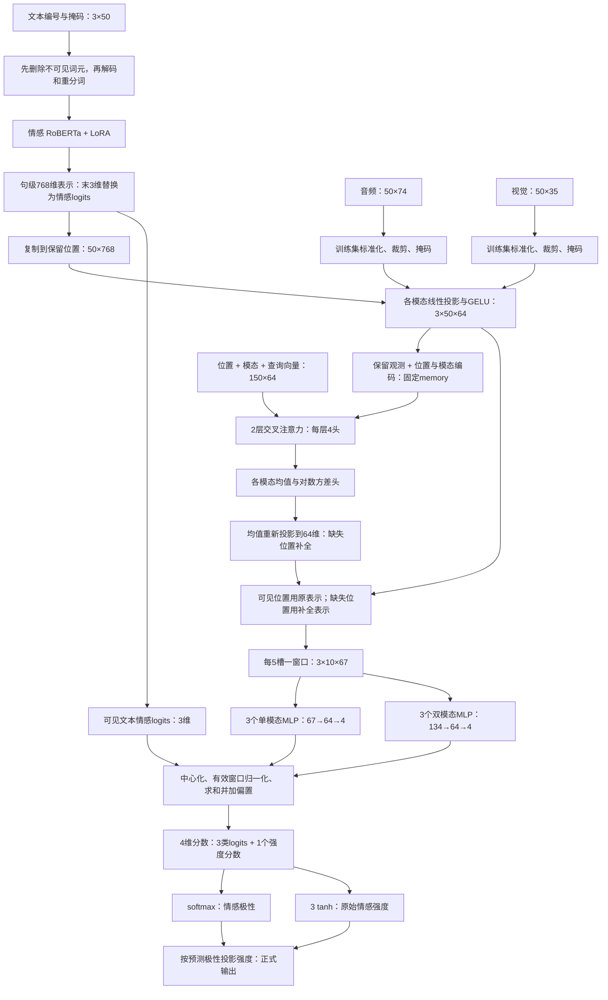

# 问题二建模思路说明：局部模态缺失下的鲁棒情感预测

> 本文参考问题一《三种模态无效片段识别方法》的讲解方式。  
> 重点回答：**哪里缺失、缺失后怎样预测、怎样判断模型是否鲁棒、最终提交什么。**  
> 实现依据：`configs/problem2_robust.json`、`AAAmodel/checkpoints/problem2_robust.pt`。当前采用条件补全与窗口交互融合，**可靠性门控经消融关闭**。

---

# 1. 总体思路

问题一关注“哪些位置可用”，问题二进一步回答：

> 当一段文本、语音或视觉信息不可用时，能否利用剩余信息继续判断情感？

整体流程为：

```text
官方三模态特征
→ 区分有效范围、原有观测和人工缺失
→ 只编码真正保留的信息
→ 利用可见信息估计缺失位置的表示
→ 融合各模态及其交互
→ 输出情感极性和情感强度
→ 验证缺失类型、位置、长度的影响
→ 对附件3全量预测并导出CSV
```

这里的“补全”是预测任务所需的特征估计，**不是还原原始音频、视频或真实缺失词句**。

---

# 2. 输入数据与问题一的关系

## 2.1 实际使用什么数据

当前问题二直接使用附件2与附件3的 **aligned_50** 版本。

| 模态 | 实际输入 | 说明 |
|---|---|---|
| 文本 | `text_bert`，3×50 | BERT词元编号、attention mask、segment编号 |
| 语音 | `audio`，50×74 | 官方预提取声学特征 |
| 视觉 | `vision`，50×35 | 官方预提取视觉特征 |

文本经过保留词元解码与RoBERTa重分词后获得句级表示。50是官方最大序列槽数，不能简单理解为50个英文单词或50秒。

## 2.2 是否直接使用问题一的输出

**当前没有把问题一的100条自提取特征并入问题二训练。**

两问共享“无效信息置零、通过Mask控制可读性”的思路，但数据来源与时间组织不同。不能把问题一的等时长窗口掩码直接套到官方词元对齐槽上。

---

# 3. 如何区分缺失、填充与真实观测

## 3.1 为什么不能只用一个Mask

一个零向量可能表示缺失，也可能表示Padding。如果把两者混在一起，模型可能错误地“补全”填充区域。

因此定义三种掩码：

| 符号 | 含义 | 取1的条件 |
|---|---|---|
| $P_t^{(m)}$ | 有效范围 | 位置属于推断的有效序列范围 |
| $O_t^{(m)}$ | 原有观测 | 原输入该位置可用 |
| $B_t^{(m)}$ | 人工保留 | 本次实验未删除该位置 |

真正允许模型读取的是：

$$M_t^{(m)}=P_t^{(m)}O_t^{(m)}B_t^{(m)}.$$

## 3.2 一个简单例子

以下只演示某个模态，不是真实样本：

```text
P：       [1, 1, 1, 1, 1, 1, 0, 0]
O：       [1, 1, 1, 1, 1, 1, 0, 0]
B：       [1, 1, 0, 0, 1, 1, 1, 1]
实际可读M：[1, 1, 0, 0, 1, 1, 0, 0]
```

第3、4个位置被连续删除，第7、8个位置是Padding，二者不能作为同一种重建目标。

## 3.3 原有观测如何判断

文本根据attention mask和词元编号判断，排除PAD、CLS、SEP作为内容观测；语音、视觉按该位置是否为全零向量判断可用性。

有效范围采用三模态支持位置的最大范围进行推断。**如果三模态尾部同时全零，现有字段不能唯一判断它是缺失还是Padding。** 当前实现记录这一不确定性，不把推断Mask当成人工真值。

---

# 4. 如何模拟“局部连续缺失”

## 4.1 删除连续区间

在某个模态的有效跨度 $[l,u)$ 内，选取一段区间：

$$[s,s+L),\qquad L=\max(1,\operatorname{round}(r(u-l))).$$

将区间中的保留掩码设为0，其余位置保留。

例如：

```text
原始语音：[可见，可见，可见，可见，可见，可见]
局部缺失：[可见，可见，缺失，缺失，可见，可见]
```

这与“删除整条语音模态”不同。

## 4.2 三个实验因素

| 因素 | 当前验证设置 |
|---|---|
| 缺失模态 | T、A、V、TA、TV、AV、TAV |
| 请求缺失比例 | 10%、30%、50%、70% |
| 缺失位置 | 开头、中间、结尾、随机 |

随机位置使用3个种子重复，固定位置各运行一次，因此共有：

$$7\times4\times(3+3)=168\text{组场景}.$$

每组均保留全部728条验证样本。

## 4.3 如何保证仍是局部缺失

严格验证时，人工删除后，原本有观测的模态至少保留一个可见位置。若区间覆盖了全部观测，就缩短区间；若原本不足两个可见位置，则不再额外删除，保留样本并记录。

请求比例不一定等于实际删除比例，因此还保存：

```text
区间起止槽位
区间长度
原可见位置数量
实际删除数量
删除后剩余数量
实际删除比例
```

该严格约束用于本轮验证；既有训练增强采用随机连续区间，未逐步保存所有训练Mask，不声称其每一步都满足同一严格边界约束。

附件2没有逐词时间戳，因此这里的“时长”是**槽位长度和相对有效跨度**，不是秒数。

---

# 5. 模型架构：三条输入支路怎样形成一个预测

## 5.1 先看完整连接关系

当前模型可以准确描述为：**情感 RoBERTa 句级先验 + 观测条件注意力补全 + 窗口级加性交互预测**。其中，注意力负责估计缺失表示；融合发生在窗口预测头中；文本先验另有一条直达分类分数的支路。



下文省略批次维，每次说明一条样本。$m\in\{T,A,V\}$ 是模态，$t=1,\ldots,50$ 是槽位，$w=1,\ldots,10$ 是窗口。$M=P\odot O\odot B$ 的定义见第3节。窗口宽度5、隐藏维64、注意力4头和2层均来自当前配置，不是临时举例。

## 5.2 第一层：三种输入并不是用同一种方法提取特征

**文本分支。** 先仅保留 $M_{T,t}=1$ 的 BERT 词元，再解码成文本，使用情感 RoBERTa 的分词器重新分词。设该模型最后一层句首表示为 $h_{\rm CLS}\in\mathbb R^{768}$，情感分类 logits 为 $\ell\in\mathbb R^3$，则实际构造：

$$
\tilde h=\operatorname{LayerNorm}(h_{\rm CLS}),\qquad
f_T=[\tilde h_{1:765};\ell_{1:3}]\in\mathbb R^{768},
$$

$$
x_{T,t}=M_{T,t}f_T\in\mathbb R^{768}.
$$

分号表示拼接。这里是**用3维 logits 替换最后3维隐藏表示**，并非把两者拼成771维。保留的每个槽位得到同一个句级向量；删除不同词元后，重新编码得到的句级向量会改变。

这意味着当前方法没有提供50个不同的逐词语义向量，也没有通过这一步恢复严格的词级音视频对齐。文本窗口之间的差异主要来自缺失分布和后续补全。局部文本解释需要删除原词元后重新编码，不能直接把广播向量当作词级贡献。

文本骨干大部分参数冻结，最后6层注意力中的 query、value 线性层使用 LoRA。对原线性映射 $W_0x+b$，实现为：

$$
Wx+b=W_0x+b+\frac{\alpha}{r}L_B L_Ax,
\quad r=4,\quad\alpha=8.
$$

$L_A\in\mathbb R^{r\times d_{in}}$、$L_B\in\mathbb R^{d_{out}\times r}$ 可训练，$W_0$ 冻结。由于 $\operatorname{rank}(L_BL_A)\le r$，用少量参数调整已有表示；原分类头在当前配置下不单独解冻。

**音频与视觉分支。** 本模型读取官方74维声学特征、35维视觉特征，不从原始波形或视频帧重新运行大网络。对第 $j$ 维：

$$
x_{m,t,j}=M_{m,t}\operatorname{clip}
\left(\frac{x^{raw}_{m,t,j}-\mu^{train}_{m,j}}
{\sigma^{train}_{m,j}},-5,5\right),\quad m\in\{A,V\}.
$$

均值、标准差仅由训练集统计。掩码乘在标准化后，确保被遮挡位置不会因减均值而变成非零输入。

## 5.3 第二层：把不同宽度的特征送到同一个空间

三种输入宽度为 $d_T=768,d_A=74,d_V=35$。每个模态各有一套投影参数：

$$
e_{m,t}=\operatorname{Dropout}\big(\operatorname{GELU}(W_mx_{m,t}+b_m)\big)
\in\mathbb R^{64},\quad W_m\in\mathbb R^{64\times d_m}.
$$

训练时特征 dropout 比例为0.2，推理时关闭。投影的作用是把不同量纲、不同宽度的表示变成可计算注意力的64维向量，并不意味着新增了原始观测信息。

加入可学习位置向量 $p_t\in\mathbb R^{64}$ 和模态向量 $a_m\in\mathbb R^{64}$：

$$
E_{m,t}=e_{m,t}+p_t+a_m.
$$

将150个位置展平组成 memory。另追加一个64维 null 向量，得到 $E\in\mathbb R^{151\times64}$。注意力只允许读取 $M=1$ 的位置；只有整条样本没有任何观测时才开放 null，避免全部键被屏蔽而产生无效数值。null 不代表真实证据。

## 5.4 第三层：缺失位置怎样向可见位置查询信息

初始查询为：

$$
Q^{(0)}_{m,t}=p_t+a_m+u_m,
$$

$u_m$ 是模态查询向量。查询共150个，维度64。当前没有开启 `contextual_fusion`，所以初始查询没有再叠加观测内容；内容通过读取 memory 进入查询。

对第 $h$ 个注意力头，$d_h=64/4=16$：

$$
Q_h=Q^{(l-1)}W_h^Q,\quad K_h=EW_h^K,\quad V_h=EW_h^V,
$$

$$
A_h=\operatorname{softmax}_{\rm key}
\left(\frac{Q_hK_h^\top}{\sqrt{16}}+\Gamma\right),
\qquad Z_h=A_hV_h.
$$

其中 $\Gamma$ 在可读取键上为0，在不可读取键上为 $-\infty$。每个 $A_h$ 的形状为 $150\times151$；每行归一化后给出一个查询对可见观测的权重。缩放因子 $\sqrt{16}$ 用于控制点积随维度增长的尺度。训练时实现还对注意力权重使用0.1 dropout。

把四个16维结果拼回64维，再执行残差与前馈更新：

$$
Z=\operatorname{Concat}(Z_1,Z_2,Z_3,Z_4)W^O,
$$

$$
U^{(l)}=\operatorname{LN}(Q^{(l-1)}+Z),
$$

$$
Q^{(l)}=\operatorname{LN}\left(U^{(l)}+
W_2\operatorname{Dropout}\big(\operatorname{GELU}(W_1U^{(l)}+b_1)\big)+b_2\right).
$$

前馈层维度为 $64\to128\to64$，共执行2层。上述线性式省略注意力投影偏置以便阅读。两层使用同一份观测 memory，但各自有独立参数；更新的是查询，不把第一层预测变成第二层的“新观测”。

因此，这是**观测条件交叉注意力补全**：查询可以读取其他模态，也可以读取本模态仍可见的位置。它不是三条序列独立编码后简单拼接，也不是对所有模态无差别做一次自注意力。

## 5.5 第四层：从查询预测缺失特征

对最后一层查询 $q_{m,t}=Q^{(2)}_{m,t}$，分别预测原特征空间的均值和对数方差：

$$
\hat\mu_{m,t}=W_m^\mu q_{m,t}+b_m^\mu\in\mathbb R^{d_m},
$$

$$
\ell_{m,t}=\operatorname{clip}(W_m^\ell q_{m,t}+b_m^\ell,-6,4),
\qquad \hat\sigma^2_{m,t}=\exp(\ell_{m,t}).
$$

注意两个维度转换：查询是64维，预测均值分别回到768、74、35维，再使用前面的投影层变成64维补全表示：

$$
\hat e_{m,t}=\operatorname{GELU}(W_m\hat\mu_{m,t}+b_m).
$$

最终每个位置选择：

$$
h_{m,t}=M_{m,t}e_{m,t}+
P_{m,t}(1-M_{m,t})\,q^{rel}_{m,t}\hat e_{m,t}.
$$

可见位置直接用原表示；有效范围内缺失位置用补全表示；Padding 为零。

**当前问题二取 $q^{rel}=1$（在有效范围内）**，即关闭可靠性衰减，但仍训练均值和方差。问题三的原检查点保留方差门控，公式在问题三说明中展开。当前也没有开启额外时序读出模块或三阶交互预测头。

---

# 6. 从补全表示推导融合与双任务输出

## 6.1 为什么64维要变成67维

模型不仅需要知道“补出的内容是什么”，还需要知道“这一段实际看到了多少”。每个位置附加三个状态量：

$$
g_{m,t}=[h_{m,t};M_{m,t};P_{m,t}(1-M_{m,t});q^{rel}_{m,t}P_{m,t}]
\in\mathbb R^{67}.
$$

每5个槽位一组，对有效范围内位置平均：

$$
z_{m,w}=\frac{\sum_{t\in w}P_{m,t}g_{m,t}}
{\max(1,\sum_{t\in w}P_{m,t})}\in\mathbb R^{67}.
$$

得到 $3\times10\times67$ 的窗口特征。末三维分别反映观测比例、缺失比例和平均可靠性。当前门控关闭时，有效窗口的最后一维为1。

**教学示例：** 一个窗口有5个有效位置，其中3个可见、2个缺失，其状态均值为 $[0.6,0.4,1]$。前64维则是3个真实表示与2个补全表示的平均。

## 6.2 三个单模态分支与三个交互分支

每个模态都有一个 $67\to64\to4$ 的 MLP：

$$
f_m(z)=W_{m,2}\tanh(W_{m,1}z+b_{m,1})+b_{m,2}.
$$

三个模态对 $TA,TV,AV$ 各有一个 $134\to64\to4$ 的 MLP：

$$
f_{ab}(z_a,z_b)=W_{ab,2}\tanh(W_{ab,1}[z_a;z_b]+b_{ab,1})+b_{ab,2}.
$$

双模态分支同时读取两个模态的窗口表示，因此可以学习“同一句话在不同语调或表情下对应不同情感”的非线性关系。三个模态对的参数不共享；同一分支在10个窗口间共享参数。

## 6.3 为什么要减去背景，再按窗口数归一化

设 $\bar z_{m,w}$ 是训练流程保存的背景窗口表示。代码在训练初始化时遍历训练集求均值并固定该缓冲量，不能把它当成最终重新拟合的情感中性基准。

先减背景输出，定义单项差值与交互差值：

$$
\tilde C_{m,w}=f_m(z_{m,w})-f_m(\bar z_{m,w}),
$$

$$
\tilde I_{ab,w}=f_{ab}(z_{a,w},z_{b,w})
-f_{ab}(\bar z_{a,w},\bar z_{b,w}).
$$

这样，当输入等于保存背景时，对应项为零，便于记录贡献。但这不保证各分支统计独立，也不保证背景期望贡献为零。

设 $a_{m,w}$ 表示该窗口是否有有效位置。令：

$$
\omega_{m,w}=\frac{a_{m,w}}{\max(1,\sum_v a_{m,v})},\qquad
\omega_{ab,w}=\frac{a_{a,w}a_{b,w}}{\max(1,\sum_v a_{a,v}a_{b,v})}.
$$

最终 $C_{m,w}=\omega_{m,w}\tilde C_{m,w}$，$I_{ab,w}=\omega_{ab,w}\tilde I_{ab,w}$。完全处于Padding的窗口不参与预测；有效窗口取平均，减少窗口数量造成的长度效应。

## 6.4 文本先验如何与多模态残差相加

文本向量的末三维保存 RoBERTa logits。对保留槽位平均：

$$
r_T=\frac{\sum_t x_{T,t,766:768}}{\max(1,\sum_tM_{T,t})}.
$$

有文本时，这就是当前保留文本的三类 logits；无文本时该项为零。文本先验只加到分类分数，不直接加到回归分数：

$$
s=b+[r_T;0]+\sum_{m,w}C_{m,w}+\sum_{a<b,w}I_{ab,w}\in\mathbb R^4.
$$

$b$ 包含代码中的学习偏置与保存的 decision_bias。融合头学习对文本先验的修正，并可单独利用音视频。分类最终结果并非直接等于文本模型的分类结果。

前三维经过 softmax：

$$
p_k=\frac{e^{s_k}}{\sum_{j=1}^3e^{s_j}},\quad
\hat c=\arg\max_kp_k.
$$

第四维经有界映射得到强度：

$$
y_0=3\tanh(s_4)\in(-3,3).
$$

这里数学下标为1到4；代码使用0到3，因此代码中的 `scores[:, 3]` 对应上式 $s_4$。

## 6.5 强度约束投影的闭式解

类别与回归头可能矛盾，因此正式输出求：

$$
y^*=\arg\min_{y\in I_{\hat c}}(y-y_0)^2,
$$

其中负、中、正三个区间分别为 $[-3,-\epsilon],\{0\},[\epsilon,3]$，$\epsilon=10^{-6}$。

对区间 $[a,b]$：若 $y_0$ 在区间内，平方误差在 $y=y_0$ 处为零；若 $y_0<a$，距离最近的是左端点；若 $y_0>b$，距离最近的是右端点。因此：

$$
y^*=\begin{cases}
\min(-\epsilon,\max(-3,y_0)),&\hat c=\text{Negative},\\
0,&\hat c=\text{Neutral},\\
\min(3,\max(\epsilon,y_0)),&\hat c=\text{Positive}.
\end{cases}
$$

投影不会改变预测类别，所以不会直接提高分类Accuracy；它仅保证两种输出一致。训练仍使用可微的原始强度 $y_0$，没有把投影操作放入反向传播。原始强度另存审计列。

---

# 7. 从概率假设推导训练目标

## 7.1 分类：由类别似然得到交叉熵

假设真值类别为 $c$，模型给它的概率为 $p_c$。最大化正确类别似然，等价于最小化负对数似然 $-\log p_c$。当前使用标签平滑 $\eta=0.05$：

$$
\tilde y_k=(1-\eta)\mathbf1\{k=c\}+\eta/3,
\qquad L_{cls}=-\sum_{k=1}^3\tilde y_k\log p_k.
$$

这保留真值类别为主要目标，同时避免把其他类别目标概率压到严格零。

## 7.2 强度：兼顾小误差拟合与大误差稳定性

令 $e=y_0-y$，当前 Huber 损失阈值为1：

$$
L_{reg}(e)=\begin{cases}\tfrac12e^2,&|e|\le1,\\|e|-\tfrac12,&|e|>1.\end{cases}
$$

小误差区间使用平方惩罚，大误差区间改成线性惩罚，减少个别大误差的影响。任务损失为：

$$
L_{task}=L_{cls}+0.2L_{reg}.
$$

## 7.3 补全：由条件高斯假设得到重建损失

假设某个被隐藏的特征标量 $x$ 在可见观测条件下服从：

$$
x\mid X_{obs}\sim\mathcal N(\hat\mu,\hat\sigma^2).
$$

概率密度为：

$$
p(x\mid X_{obs})=\frac{1}{\sqrt{2\pi\hat\sigma^2}}
\exp\left[-\frac{(x-\hat\mu)^2}{2\hat\sigma^2}\right].
$$

取负对数，并令 $\ell=\log\hat\sigma^2$：

$$
-\log p(x\mid X_{obs})=
\tfrac12\log(2\pi)+\tfrac12\ell+
\tfrac12(x-\hat\mu)^2e^{-\ell}.
$$

去掉与参数无关的常数，得到代码使用的单元素损失：

$$
L_{NLL}=\tfrac12\big[(x-\hat\mu)^2e^{-\ell}+\ell\big].
$$

误差项要求均值接近目标，对数方差项抑制无限增大方差。注意这只是一个条件对角高斯建模假设，不能由此宣称方差已得到统计校准。

只有原本可见、后来人工隐藏的位置有重建目标：

$$
H=P\land O\land\neg B.
$$

实现先对每个有隐藏位置的模态内部按位置、特征维度取平均，再对这些模态等权平均；不是让768维文本自动获得比35维视觉更大的权重。文本重建目标是完整视图的句级广播表示，音视频目标是标准化特征；完整视图目标使用 `detach`，不通过目标分支回传重建梯度。

## 7.4 两个视图共同训练同一套参数

同一条样本分别运行完整观测视图与随机连续缺失视图，二者共享全部模型参数、类别与强度标签：

$$
L=L_{task}^{full}+0.15\gamma_eL_{task}^{missing}
+0.02\gamma_eL_{rec},\qquad
\gamma_e=\min(1,(e+1)/8).
$$

$e$ 从0开始，前8个epoch逐渐增加缺失与重建项权重。缺失率为10%、30%、50%。损失对批次取平均，梯度更新 LoRA、投影、注意力补全层、均值方差头、窗口预测头及相关可学习向量。当前未启用一致性损失或Mixup。

需要区分：注意力结构、Huber、损失权重等是建模选择；高斯NLL与区间投影则是在相应假设或约束下推导得到的形式。不能把所有结构超参数称为数学必然结论。

## 7.5 模型如何选择

训练集3395条用于学习参数，验证集728条用于选模，附件3无标签。先按完整与30%三模态缺失的表现选择epoch，再用七种模态组合、30%随机缺失和三个种子比较候选：

$$
J=\tfrac12(1-F1_{full}+MAE_{full}/3)
+\tfrac12\operatorname{mean}(1-F1_{local}+MAE_{local}/3).
$$

$J$ 越小越优，是项目自定准则，不是官方总分。最终比较采用统一输出规则；训练期epoch选择使用原始强度，不能混写成完全相同的评估流水线。当前选中无可靠性门控的专项模型，不能把原完整观测模型测试分数移作它的测试成绩。

---

# 8. 如何判断“鲁棒”，目前结果怎样

需要同时看两件事：

1. 缺失后是否仍能输出合法、有限的预测；
2. 缺失后性能相对完整观测下降多少。

例如：

$$\Delta Acc=Acc_{full}-Acc_{missing},\qquad
\Delta MAE=MAE_{missing}-MAE_{full}.$$

当前专项模型在完整验证集上的Accuracy为67.58%，Macro-F1为0.6399，统一输出后的MAE为0.5377、Pearson为0.7215。

三模态同时局部缺失时，四类位置等权平均Accuracy为：

| 请求缺失比例 | 验证Accuracy |
|---|---:|
| 10% | 66.09% |
| 30% | 61.20% |
| 50% | 55.72% |
| 70% | 46.81% |

主要结论：含文本的缺失影响明显更大；单独视觉缺失影响较小且不严格单调；高缺失率下性能仍明显退化。70%超过训练最大缺失率，属于高缺失外推验证。

**合法输出不等于高准确率，不能据此声称局部缺失问题已完全解决。** 原模型完整测试集70.70%也不是当前专项模型的测试成绩。

---

# 9. 最终输出什么

正式附件3预测共30条，保存：

```text
sample_id
source_file
polarity
intensity
```

文件：[附件3预测结果](results/robust_selected/附件3_预测结果.csv)。另存原始强度、零值候选区间、模型哈希与覆盖校验。附件3没有标签，不报告其Accuracy。

规律分析输出位于 `results/local_robustness/selected_full`，包括每组预测、实际Mask、类型/位置/长度汇总与随机种子变化。图表位于 `figures/local_robustness`。

| 步骤 | 代码 |
|---|---|
| 有效范围与原观测 | `shared/data.py` |
| 编码、条件补全、融合 | `model.py`、`completion.py`、`heads.py` |
| 训练与损失 | `training.py`、`training_step.py`、`losses.py` |
| 严格局部缺失 | `local_missingness.py`、`local_evaluation.py` |
| 规律汇总 | `local_report.py` |
| 一致输出与专项预测 | `output_contract.py`、`inference.py` |
| 独立核验 | `verify_submission.py` |

---

# 10. 论文中的概括表述

> 针对局部连续模态信息缺失，本文区分有效序列范围、原始观测与人工删除掩码，在编码前屏蔽不可用输入，并以保留观测为条件估计缺失位置的任务表示。通过单模态窗口贡献与模态间交互联合预测情感极性和强度，使用完整视图监督、缺失视图监督及隐藏观测重建进行训练。依据验证集完整与局部缺失条件下的分类和回归表现选择模型，最终保留条件补全、关闭未显示收益的可靠性门控。进一步按缺失类型、位置及相对长度开展对照，并在统一输出规则下完成附件3全量预测。实验显示文本缺失最为敏感，重度缺失条件下的性能稳定性仍有改进空间。

详细推导及实验依据见[模型方法与公式推导](模型方法与公式推导.md)和[局部缺失建模与题意核对](局部缺失建模与题意核对.md)。
